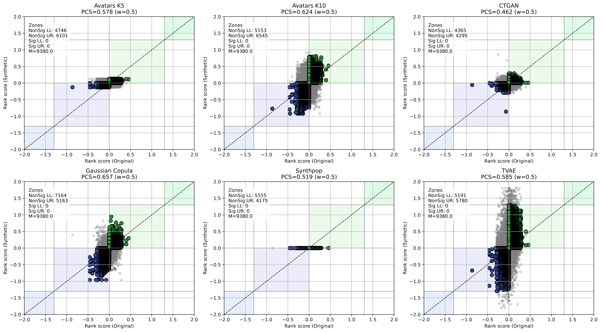

# Differential Gene Expression (DGE)

DGE analysis identifies genes with statistically significant expression changes between biological conditions. 

## Gene Concordance Score (GCS)

To validate the performance of synthetic data in preserving differential expression signals, we developed metric called Gene Concordance Score (GCS). This metric provides a single integrated measure that quantifies the weighted proportion of synthetic genes concordant with the original data across two key dimensions: regulation direction (up- or down-regulation) and level of statistical significance. Higher GCS values indicate a larger proportion of synthetic genes that faithfully preserve both the directionality and the degree of statistical significance observed in the original pathways. 

### Step 1: Rank Score Calculation

Each gene $i$ is assigned a rank score combining effect size and significance:

$$\text{RS}_i = \text{sign}(\log_2\text{FC}_i) \times \bigl(-\log_{10}(q\text{-value}_i)\bigr)$$

### Step 2: Concordance Zone Identification

A significance boundary is defined at $s_{\text{thr}} = -\log_{10}(0.05)$. Four concordance zones are defined in the $\text{RS}_\text{original}$ vs $\text{RS}_\text{synthetic}$ plane:

- **Significant zones** (zones 3 & 4): Genes significant in the same direction in both datasets → count $N_\text{sig}$
- **Non-significant zones** (zones 1 & 2): Genes non-significant but directionally concordant → count $N_\text{non-sig}$

### Step 3: GCS Calculation

$$\text{GCS} = \frac{N_\text{sig} + \omega \cdot N_\text{non-sig}}{M}$$

$$M = N_\text{sig}^\text{original} + \omega \cdot N_\text{non-sig}^\text{original}$$

where $\omega = 0.5$ assigns lower weight to non-significant genes, prioritizing biologically meaningful signals.

## Code Example

The `GCSAnalyzer` class provides the full workflow for computing GCS and generating scatter plots:

```python
from SynOmics.metrics.narrow_utility.DGE import GCSAnalyzer

original_dge = pd.read_csv('original_dge_path.csv')
synthetic_dge =  pd.read_csv('synthetic_dge_path.csv')
# Initialize with column mappings
analyzer = GCSAnalyzer(
    term_col="Gene",
    nes_col="Log2FC",
    q_col="Q_value",
    q_thr=0.05,
    w=0.5
)

# Process a single synthetic dataset
(rankscore_or, rankscore_syn, gcs, n1, n2, n3, n4, m, ori_size, aligned_size, seed) = \
    analyzer.process_single_dge_result(original_dge, synthetic_dge)

print(f"GCS: {gcs:.3f}")
print(f"Significant concordant genes: {n3 + n4}")
```

## Scatter Plot Visualization

The scatter plot shows the rank score comparison between original and synthetic data, with concordance zones color-coded. The following code produces manuscript-quality GCS scatter plots using the **Melanoma** cohort as an example:

```python
from SynOmics.metrics.narrow_utility.DGE import GCSAnalyzer

analyzer = GCSAnalyzer(
    term_col="Gene",
    nes_col="Log2FC",
    q_col="Q_value",
    q_thr=0.05,
    w=0.5
)

# Map method names to synthetic DGE result CSV paths
dataset_dict = {
    "Avatars K5": "DGE/avatarsk5_0.csv",
    "Avatars K10": "DGE/avatarsk10_0.csv",
    "CTGAN": "DGE/ctgan_0.csv",
    "Gaussian Copula": "DGE/gaussiancopula_0.csv",
    "Synthpop": "DGE/synthpop_0.csv",
    "TVAE": "DGE/tvae_0.csv",
}

# Plot all methods in a grid
fig, axs = analyzer.plot_gcs_datasets(
    ori_path="DGE/origin.csv",
    dataset_dict=dataset_dict,
    figsize=(18, 10)
)
fig.savefig("dge_gcs_scatter.png", dpi=300, bbox_inches="tight")
```



*Scatter plots of gene rank scores (Original vs. Synthetic) for each SDG method in the Melanoma cohort. Points in colored zones indicate concordant genes; the GCS value is shown in each panel.*
