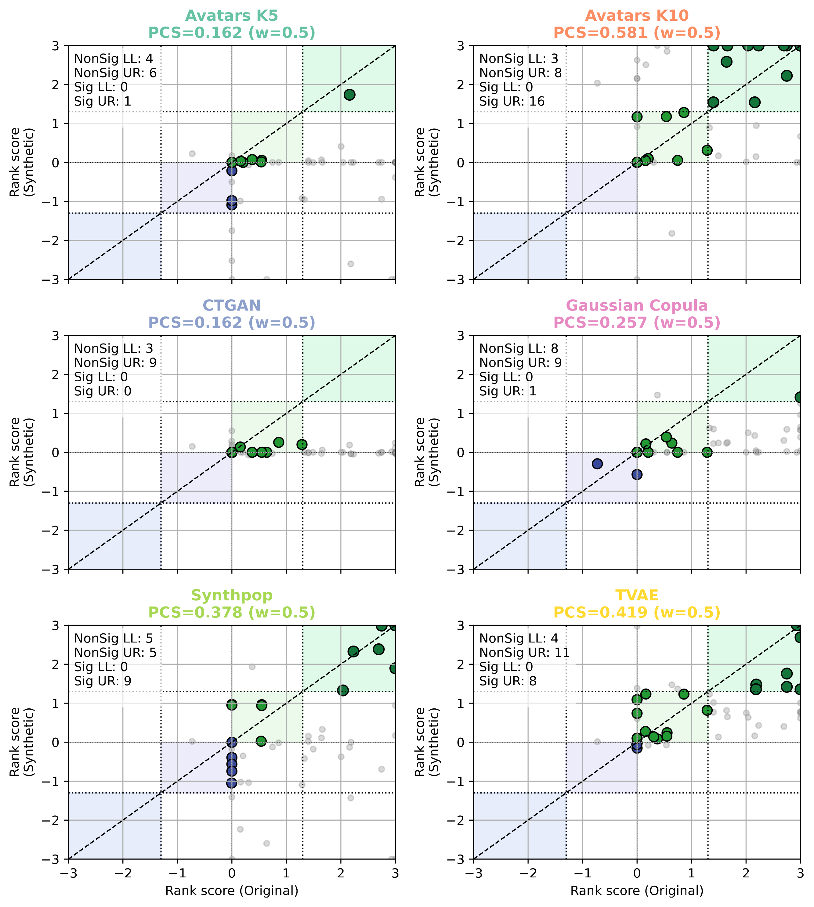

# Gene Set Enrichment Analysis (GSEA)

GSEA identifies biological pathways that are coordinately regulated between conditions. Unlike DGE which focuses on individual genes, GSEA considers entire functional gene sets.

## Pathway Concordance Score (PCS)

The PCS quantifies the agreement in pathway enrichment between original and synthetic datasets, following the same framework as the GCS.

### Rank Score Calculation

For each pathway $p$, a rank score integrates the direction and significance of enrichment:

$$\text{RS}_p = \text{sign}(\text{NES}) \times \bigl(-\log_{10}(\text{FDR-}q_p)\bigr)$$

### PCS Formula

$$\text{PCS} = \frac{N_\text{sig} + \omega \cdot N_\text{non-sig}}{M}$$

where $N_\text{sig}$ counts concordant significant pathways, $N_\text{non-sig}$ counts concordant non-significant pathways, $\omega = 0.5$, and $M$ normalizes based on the original pathway counts.

## Code Example

The `PCSAnalyzer` class computes PCS and generates scatter plots:

```python
from SynOmics.metrics.narrow_utility.GSEA import PCSAnalyzer

analyzer = PCSAnalyzer(
    term_col="Term",
    nes_col="NES",
    q_col="FDR q-val",
    q_thr=0.05,
    w=0.5
)
or_gsea_df = pd.read_csv('original_gsea_result.csv')
syn_gsea_df = pd.read_csv('synthetic_gsea_result.csv')

# Process a single synthetic GSEA result
x, y, result = analyzer.process_single_gsea_result(
    gsea_ori=or_gsea_df,
    gsea_syn=syn_gsea_df
)

print(f"PCS: {result.pcs:.3f}")
print(f"Significant concordant pathways: {result.n_sign}")
```

## Scatter Plot Visualization

The following code generates manuscript-quality PCS scatter plots using the **Melanoma** cohort as an example:

```python
from SynOmics.metrics.narrow_utility.GSEA import PCSAnalyzer

analyzer = PCSAnalyzer(
    term_col="Term",
    nes_col="NES",
    q_col="FDR q-val",
    q_thr=0.05,
    w=0.5
)

# Map method names to synthetic GSEA CSV paths
dataset_dict = {
    "Avatars K5": "GSEA/avatarsk5_0.csv",
    "Avatars K10": "GSEA/avatarsk10_0.csv",
    "CTGAN": "GSEA/ctgan_0.csv",
    "Gaussian Copula": "GSEA/gaussiancopula_0.csv",
    "Synthpop": "GSEA/synthpop_0.csv",
    "TVAE": "GSEA/tvae_0.csv",
}

fig, axs = analyzer.plot_gsea_datasets(
    ori_data="GSEA/original_data.csv",
    dataset_dict=dataset_dict,
    figsize=(9, 10)
)
fig.savefig("gsea_pcs_scatter.png", dpi=300, bbox_inches="tight")
```



*Scatter plots of pathway rank scores (Original vs. Synthetic) for each SDG method in the Melanoma cohort. The PCS value is shown in each panel.*