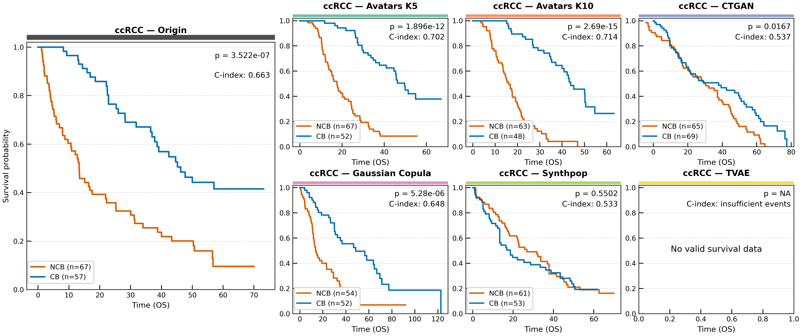

# Survival Analysis

Survival analysis evaluates whether synthetic data preserves clinically meaningful survival patterns by comparing Overall Survival (OS) and Progression-Free Survival (PFS) between treatment responders and non-responders.

## C-index Score

The **C-index score** measures similarity based on the absolute difference between original and synthetic concordance indices from Cox proportional hazards models:

$$C_\text{score}^\text{OS} = 1 - \left|C_\text{original}^\text{OS} - C_\text{synthetic}^\text{OS}\right|$$

$$C_\text{score}^\text{PFS} = 1 - \left|C_\text{original}^\text{PFS} - C_\text{synthetic}^\text{PFS}\right|$$

$$C_\text{score}^\text{final} = \frac{C_\text{score}^\text{OS} + C_\text{score}^\text{PFS}}{2}$$

Higher values indicate greater agreement in survival discrimination. Kaplan-Meier survival curves are compared using the **log-rank test**.

## Code Example

```python
from synomicsbench.metrics.narrow_utility.survival_analysis import  SurvivalEvaluator

#Define dataset dictionary
dataset_dict = {}
survival_cols = ['OS', 'OS_CNSR','Benefit']
original_data = pd.read_csv('original_data.csv')
dataset_dict["Original_data"] = original_data[cols]
synthetic_data = pd.read_csv('synthetic_data.csv')
dataset_dict['Synthetic_data'] = synthetic_data[survival_cols]


# Define phenotype comparison
phenotype = {"Benefit": ["CB", "NCB"]}

# Define evaluator
evaluator = SurvivalEvaluator(
    datasets_dict=dataset_dict,
    phenotype=phenotype,
    time_target="OS",
    event_target="OS_CNSR",
    original_name="Original_data"
)

# Compute C-index similarity scores with respect to Original data
summary_df = evaluator.compute_survival_metrics()
scored_df = evaluator.compute_cindex_scores(original_name="Original_data")

# Extract the C-index score
synthetic_score = scored_df.loc[scored_df['Dataset'] == 'Synthetic_data', 'C-index_score'].values[0]
print(f"Synthetic Score: {synthetic_score:.4f}")
```

## Kaplan-Meier Curve Visualization

```python
from synomicsbench.metrics.narrow_utility.survival_analysis import  SurvivalEvaluator

# Define datasets
datasets = {
    "Original": real_df,
    "Gaussian Copula": gc_df,
    "Avatars K5": avatars_k5_df,
    "Avatars K10": avatars_k10_df,
    "CTGAN": ctgan_df,
    "Synthpop": synthpop_df,
    "TVAE": tvae_df,
}

phenotype = {"Benefit": ["CB", "NCB"]}

evaluator = SurvivalEvaluator(
    datasets_dict=datasets,
    phenotype=phenotype,
    time_target="OS",
    event_target="OS_CNSR",
    original_name="Original_data"
)
evaluator.compute_survival_metrics()
fig, summary = evaluator.plot_grid(
    save_dir = 'survial_analysis_comparison.png'
)

# Each panel shows: Kaplan-Meier curves, log-rank P value, C-index
```



*Survival signal preservation across SDG methods. Log-rank P values and C-indices are annotated in each panel.*