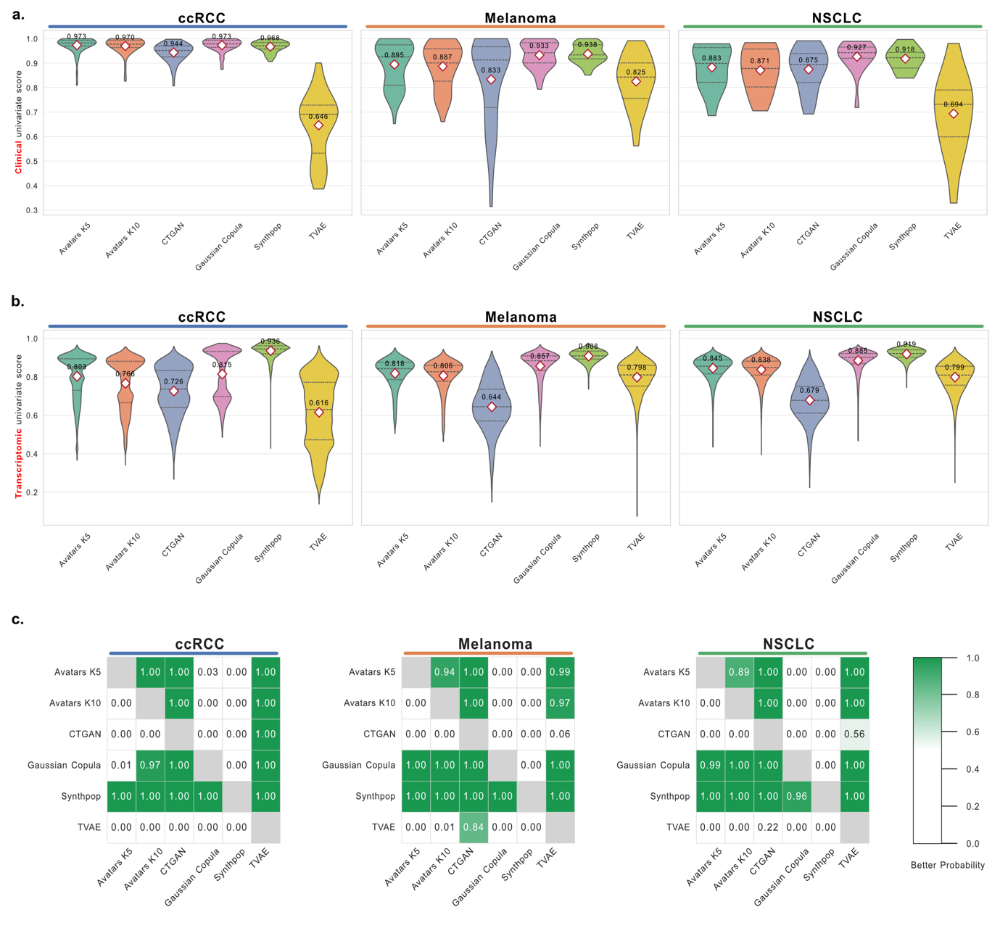
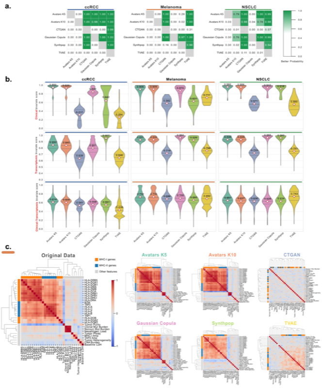

# Broad Utility Evaluation

Broad utility assessment evaluates the ability of synthetic data generation methods to preserve the general statistical properties of the original dataset. In SynOmicBench, this is quantified through univariate and bivariate similarity metrics, ensuring that both individual feature distributions and inter-feature dependencies are accurately captured.

## Univariate Similarity

Univariate similarity measures how well the distribution of each feature in the synthetic data matches the corresponding feature in the real dataset. This is crucial for ensuring that basic statistical summaries and the overall shape of the data are maintained.

### Metrics

We utilize two primary metrics for univariate assessment:

1. **Kolmogorov-Smirnov (KS) Statistic:** A non-parametric test that quantifies the maximum distance between the empirical cumulative distribution functions (ECDF) of the real and synthetic data, applied to numerical features.
2. **Total Variation Distance (TVD):** A metric for comparing categorical distributions, measuring the maximum difference between probability mass functions.

### Results

Our evaluation across diverse cohorts (ccRCC, Melanoma, NSCLC) reveals distinct performance patterns across synthesizers. Synthpop consistently outperformed other methods across all three cohorts, achieving mean scores above 0.92 (e.g., 0.952 ± 0.001 for ccRCC). In contrast, TVAE exhibited the lowest values and highest variability, particularly within the ccRCC cohort (0.627 ± 0.027).

A clear divide emerges between data types. Most methods handled clinical attributes well, with both Synthpop and Gaussian Copula maintaining tight distributions and high fidelity. However, the high-dimensional nature of transcriptomic data proved much more difficult to replicate. While deep learning methods such as CTGAN and TVAE showed inconsistent performance across gene expression profiles, Synthpop remained highly stable, maintaining a consistent mean score above 0.90 in all three cancers.

Bayesian analysis on the results of 5 replicates confirmed that Synthpop achieves close to 100% probability of superior performance over all other methods for all tested oncology cohorts.

**Analysis notebook:** `Manuscripts/ccRCC/BroadUtility/UniSimi_Transcriptome.ipynb`



*Figure 2: Distribution of univariate similarity metrics (KS Statistic and TVD) across evaluated synthesizers for clinical and transcriptomic features.*

---

## Bivariate Similarity

Bivariate similarity evaluates the preservation of relationships between pairs of features. In multi-omics data, capturing these correlations is essential for maintaining biological validity and downstream utility.

### Metrics

We compute bivariate similarity by comparing correlation structures between real and synthetic data:

- **Spearman's Rank Correlation:** For numerical feature pairs
- **Cramér's V:** For categorical associations

These metrics are aggregated into an overall bivariate score that quantifies how well the inter-variable relationships are preserved.

### Results

While univariate metrics confirm that marginal distributions are preserved, they do not guarantee that the intricate co-dependence between features is captured. The bivariate results indicate a substantial shift in method performance. Synthpop, which led in univariate validation, was surpassed by Avatars K5 and Gaussian Copula.

Avatars K5 achieved the best performance for ccRCC (0.995 ± 0.001) and NSCLC (0.941 ± 0.003) datasets, whereas Gaussian Copula obtained the best fidelity in the Melanoma dataset (0.939 ± 0.001). Throughout all three cancer datasets, pairwise Bayesian comparison heatmaps indicate that Gaussian Copula and Avatars (K5/K10, depending on cohort) consistently demonstrate the highest probabilities of outperforming other methods in preserving bivariate relationships.

**Analysis script:** `Manuscripts/ccRCC/BroadUtility/PairwiseTranscriptomics.py`



*Figure 3: Comparison of correlation preservation and bivariate similarity across different cohorts and methods.*

---

## Bayesian Comparison Framework

Both univariate and bivariate similarity assessments utilize Bayesian pairwise comparisons to rigorously evaluate performance differences between synthesizers. This approach estimates the posterior probability that one method outperforms another, accounting for uncertainty across multiple replicates.

The Bayesian framework employs a correlated t-test with a Region of Practical Equivalence (ROPE) threshold of 0.01, allowing us to distinguish between methods that are practically equivalent versus those with meaningful performance differences. Results are visualized as N×N heatmaps where each cell represents P(row > column), indicating the probability that the row method achieves superior performance.

For detailed methodology, see [Bayesian Comparison Framework](index.md#bayesian-comparison-framework).

---

## Code Example: Computing Similarity

SynOmicBench provides dedicated classes to compute these metrics. Below is an example of how to use `UnivariateSimilarity` and `PairwiseSimilarity`.

```python
import pandas as pd
from SynOmics.metrics.fidelity.UnivariateSimilarity import UnivariateSimilarity
from SynOmics.metrics.fidelity.PairwiseSimilarity import PairwiseSimilarity

# Load original and synthetic data
real_df = pd.read_csv("data/real_ccrcc.csv")
syn_df = pd.read_csv("data/synthetic_ccrcc.csv")

# 1. Compute Univariate Similarity (KS and JS)
uni_sim = UnivariateSimilarity()
ks_results = uni_sim.compute_ks_statistic(real_df, syn_df)
js_results = uni_sim.compute_js_divergence(real_df, syn_df)

print(f"Mean KS Statistic: {ks_results['ks_stat'].mean():.4f}")
print(f"Mean JS Divergence: {js_results['js_div'].mean():.4f}")

# 2. Compute Bivariate Similarity (Correlation Matrix Difference)
pair_sim = PairwiseSimilarity()
corr_diff = pair_sim.compute_correlation_similarity(real_df, syn_df)

print(f"Mean Correlation Absolute Error: {corr_diff:.4f}")

# Visualize the correlation matrix difference
pair_sim.plot_correlation_comparison(real_df, syn_df, save_path="plots/corr_diff.png")
```

For a deeper dive into these metrics across all evaluated cohorts, please see our [Broad Utility Notebooks](../../site/notebooks/FigureBroadUtility/).
