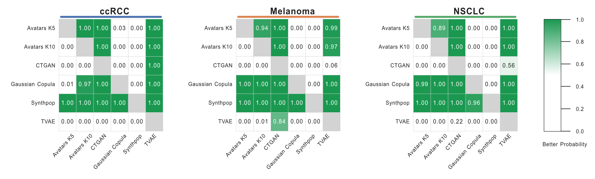

# Evaluation Framework

SynOmicsBench evaluates synthetic cancer omics data across three complementary dimensions to ensure that generated datasets are statistically similar to the original (Statistical fidelity), biologically meaningful for downstream analyses (Biological utility), and safe for data sharing (Privacy). This multidimensional approach addresses the fundamental trade-off between utility and privacy.

---

## Evaluation Dimensions

Our evaluation framework is organized into three distinct pillars, each measuring different aspects of synthetic data quality:

### [Statistical Fidelity](statistical-fidelity.md)

Statistical fidelity assesses how well the synthetic data preserves the global statistical properties of the original dataset.
<div class="grid cards" markdown>

-   **[Univariate Similarity](statistical-fidelity.md#univariate-similarity)**

-   **[Bivariate Similarity](statistical-fidelity.md#bivariate-similarity)**
</div>

This dimension provides the first line of evaluation for any synthetic data generation method.

### [Biological Utility](biological-utility/index.md)

Biological utility focuses on task-specific performance in clinically relevant downstream analyses. Statistical fidelity does not always guarantee that biological signals are preserved for scientific discovery.

<div class="grid cards" markdown>

-   **[Differential Gene Expression (DGE)](biological-utility/dge.md)**

-   **[Gene Set Enrichment (GSEA)](biological-utility/gsea.md)**

-   **[Single-sample Gene Set Enrichment (ssGSEA)](biological-utility/ssgsea.md)**

-   **[Cell Type Deconvolution](biological-utility/cell-deconvolution.md)**

-   **[Survival Analysis](biological-utility/survival-analysis.md)**

</div>

These tasks directly assess whether synthetic data can support real-world biological research.

### [Privacy Risk](privacy.md)

Privacy evaluation quantifies the disclosure vulnerability of the synthetic data, aligned with European Data Protection Board (EDPB) principles. We leverage the [Anonymeter Framework](https://petsymposium.org/popets/2023/popets-2023-0055.php) to evaluate the privacy risk under three attack scenarios:

- **Singling-Out**: The risk of isolating a unique individual in the dataset based on their attributes
- **Linkability**: The risk of connecting records from the synthetic dataset to the original or other external datasets
- **Inference**: The risk of deducing sensitive attribute values from other available information

### [Automatic Benchmark](autobenchmark.md)

Rather than computing each of the three pillars separately and aggregating the results by hand, the **Automatic Benchmark** runs every dimension in one pass and produces a rank-derived meta-score plus a comprehensive report — the recommended entry point once you have multiple candidate SDG methods to compare.

---

## Bayesian Comparison Framework

The high computational cost of synthetic data generaion under clinical transcriptomic settings constrains the number of generating replicates to which traditional p-values are not robust. To address the limited sample size and maximize the robustness of comparison, we implement a rigorous Bayesian comparison approach. The Bayesian approach enables an uncertainty-aware comparison by estimating the probability that one method outperforms another across the distribution of replicates, thereby avoiding binary conclusions while remaining appropriate for small-sample evaluation.

### Methodology

We perform pairwise Bayesian comparisons following the framework proposed by [Benavoli et al.](https://jmlr.org/papers/v18/16-305.html), using the *baycomp* Python library. A Bayesian correlated t-test is applied to estimate posterior probabilities for three mutually exclusive hypotheses:

- **Better probability** ($P(SDG_{1} > SDG_{2})$): the probability that $SDG_{1}$ outperforms $SDG_{2}$
- **Worse probability** ($P(SDG_{1} < SDG_{2})$): the probability that $SDG_{1}$ underperforms $SDG_{2}$
- **Practical equivalent probability**: the probability that the performance difference lies within a predefined Region of Practical Equivalence (ROPE)


### Usage Example

#### Pairwise Comparison

To compare specific methods and obtain the Bayesian probability estimates:

```python
from synomicsbench.metrics.fidelity.BayesianComparison import BayesianComparison

bc = BayesianComparison(rope=0.01)

score_ccrcc = {
    'Avatars K10': [0.868223, 0.870562, 0.866601, 0.871735, 0.869462],
    'CTGAN': [0.834993, 0.805653, 0.821708, 0.816810, 0.809196]
}

compare_result = bc.compare_methods(
    method_to_scores=score_ccrcc,
    methods_order=['Avatars K10', 'CTGAN'],
)
```

**Output:**

| Method 1    | Method 2    |   Better Prob |   Worse Prob |   Equivalent Prob |
|:------------|:------------|--------------:|-------------:|------------------:|
| Avatars K10 | CTGAN       |   0.995937    |  0.000969485 |        0.00309318 |
| CTGAN       | Avatars K10 |   0.000969485 |  0.995937    |        0.00309318 |

#### Heatmap Visualization

You can also compute and visualize probability heatmaps for multiple cohorts and methods simultaneously:

```python
from synomicsbench.metrics.fidelity.BayesianComparison import BayesianComparison

Univariate_Score_Dict = {
    'ccRCC': {
        'Avatars K5': [0.8881120877695017, 0.890477305776368, 0.8905614386501237, 0.8888098881167701, 0.8913354237600071],
        'Avatars K10': [0.8682233057904494, 0.8705623113141328, 0.8666012789137973, 0.8717350925047507, 0.869462903338299],
        'CTGAN': [0.8349935442546923, 0.8056530676365664, 0.8217082370402533, 0.8168101267159, 0.8091963081738267],
        'Gaussian Copula': [0.8939178299457882, 0.888584901789092, 0.8908454392711511, 0.886851763847271, 0.883785424538307],
        'Synthpop': [0.9518448306115543, 0.9532236382164678, 0.9517425968988666, 0.9503118851292676, 0.9534472187997605],
        'TVAE': [0.6309826968017754, 0.621016865353633, 0.6637430006699062, 0.5812554183782042, 0.6395117650457438]
    },
    'Melanoma': {
        'Avatars K5': [0.8564967958041939, 0.8566124125620105, 0.8557903057614384, 0.8552329963363088, 0.861733435106733],
        'Avatars K10': [0.8466413890303546, 0.8432481904403524, 0.8421363812805591, 0.8407387666940881, 0.8438034236667638],
        'CTGAN': [0.7386315254751082, 0.7627143040836618, 0.7829547727714179, 0.7675820451259966, 0.7806570896923586],
        'Gaussian Copula': [0.8947284965524952, 0.8910051558010256, 0.894645248824405, 0.8926649796604031, 0.8936413709040798],
        'Synthpop': [0.9228348197885513, 0.9161532463334907, 0.9268803262950096, 0.9306173790084618, 0.921938807240532],
        'TVAE': [0.8118174428996952, 0.8155383849775407, 0.7688229113356462, 0.8111297666213386, 0.8032479967530497]
    },
    'NSCLC': {
        'Avatars K5': [0.8640593599686472, 0.8697787139827998, 0.8702699655884499, 0.8671504554801867, 0.8639593703968106],
        'Avatars K10': [0.8543093480034314, 0.854821534289125, 0.8519989756828202, 0.8488335579271308, 0.8541274238575611],
        'CTGAN': [0.7767114152979895, 0.7500690012214213, 0.7827400422596005, 0.7734342410909774, 0.7250724465427827],
        'Gaussian Copula': [0.9057809875606977, 0.8996162072029326, 0.8935751605323073, 0.9016654341446757, 0.9065041456658781],
        'Synthpop': [0.9184738919693407, 0.9231041713180277, 0.9282744185326606, 0.9296057084197769, 0.9232167259549566],
        'TVAE': [0.7460308291609655, 0.7440953841590348, 0.754862702150197, 0.712140411911071, 0.7793414436344053]
    }
}

bc = BayesianComparison(rope=0.01)
cancers = ["ccRCC", "Melanoma", "NSCLC"]
methods_order = ["Avatars K5", "Avatars K10", "CTGAN", "Gaussian Copula", "Synthpop", "TVAE"]
fig, axes, mats_by_cancer, comp_by_cancer = bc.plot_pbetter_heatmap_grid(
    cancer_to_method_scores=Univariate_Score_Dict,
    cancers_order=cancers,
    methods_order=methods_order,
    value_col="Better Prob", 
    figsize=(18, 5),
    annot=True,
    fmt=".2f",
)

fig.savefig("bayesian_comp_fig2c_uni.pdf", bbox_inches="tight", facecolor="white")

for cancer in cancers:
    bayesian_comp_df = comp_by_cancer[cancer]
    bayesian_comp_df.to_csv(f'UnivariateBayesian_estimation_{cancer}.csv')
```
