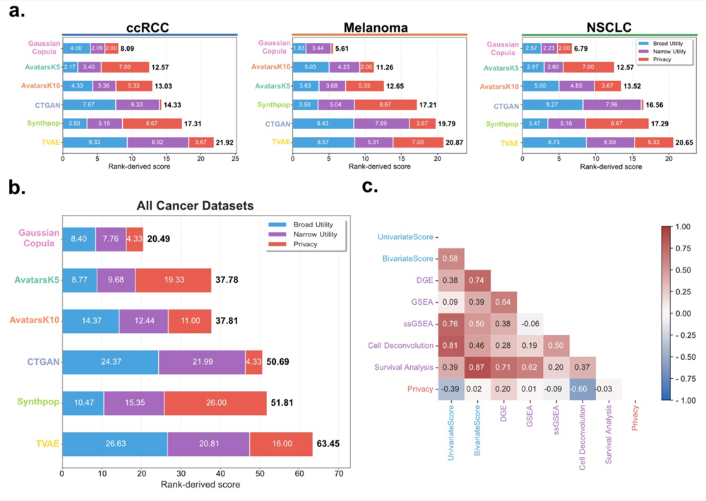

# Meta-Ranking & Stability Analysis

This page documents the overall performance ranking of synthetic data generation (SDG) methods evaluated in SynOmicBench. We use a multi-dimensional ranking approach that aggregates results across broad utility, narrow utility, and privacy risk to identify which methods provide the most balanced performance for high-dimensional cancer omics data.

## Overall Method Ranking

No single method dominates all dimensions of evaluation. Instead, we observe a clear trade-off between statistical fidelity, biological utility, and privacy preservation.

*Figure 10: Meta-ranking results across three cancer datasets (ccRCC, Melanoma, NSCLC). (a) Rank-derived scores for individual datasets. (b) Aggregate ranking across all dimensions. (c) Correlation matrix of evaluation metrics.*

### Aggregate Performance Scores

The following table summarizes the aggregate scores across all evaluated cancer datasets (ccRCC, Melanoma, and NSCLC). Lower total scores indicate a better overall ranking, representing a more favorable balance of utility and privacy.

| Method | Broad Utility | Narrow Utility | Privacy | **Total Score** |
| :--- | :---: | :---: | :---: | :---: |
| **Gaussian Copula** | 8.40 | 7.76 | 4.33 | **20.49** |
| **AvatarsK5** | 8.77 | 9.68 | 19.33 | **37.78** |
| **AvatarsK10** | 14.37 | 12.44 | 11.00 | **37.81** |
| **CTGAN** | 24.37 | 21.99 | 4.33 | **50.69** |
| **Synthpop** | 10.47 | 15.35 | 26.00 | **51.81** |
| **TVAE** | 26.63 | 20.81 | 16.00 | **63.45** |

### Key Finding: Gaussian Copula is Most Balanced

The **Gaussian Copula** method consistently emerged as the most balanced synthesizer in our benchmark. It achieved the lowest total score (20.49), significantly outperforming deep learning-based methods like CTGAN and TVAE in both utility dimensions while maintaining a low privacy risk profile (score: 4.33).

Its success can be attributed to its ability to model the complex correlation structure of omics data through multivariate normal transformations, which proves more robust for the typical sample sizes found in clinical cancer cohorts compared to data-hungry neural networks.

## Bayesian Comparison & Superiority

To ensure the statistical robustness of our rankings, we employ a **Bayesian Comparison Framework**. Unlike traditional frequentist tests, this approach allows us to quantify the **Posterior Probability of Superiority**.

### Methodology
We compare methods pairwise across multiple seeds and datasets. We define a **Region of Practical Equivalence (ROPE)**—typically set at 0.01—where two methods are considered equivalent if the difference in their performance metrics falls within this range.

The framework calculates three probabilities:
1.  **$P(\text{Method A} > \text{Method B})$**: The probability that Method A is practically better than Method B.
2.  **$P(\text{Method B} > \text{Method A})$**: The probability that Method B is practically better than Method A.
3.  **$P(\text{Equivalence})$**: The probability that both methods perform within the ROPE.

### Superiority Results
Our Bayesian analysis confirms that Gaussian Copula has a high posterior probability of superiority (often $> 0.95$) over CTGAN and TVAE across most broad utility metrics. However, when compared to Avatars (K=5), the probability of superiority shifts depending on whether the priority is utility (favoring Copula) or specific privacy guarantees (where Avatars provides K-anonymity by design).

## Stability Across Datasets

A critical requirement for a reliable SDG method is stability across different biological contexts. We evaluated the rank-derived scores across three distinct cancer types to assess consistency.

| Method | ccRCC Score | Melanoma Score | NSCLC Score |
| :--- | :---: | :---: | :---: |
| **Gaussian Copula** | 8.09 | 5.61 | 6.79 |
| **AvatarsK5** | 12.57 | 12.65 | 12.57 |
| **AvatarsK10** | 13.03 | 11.26 | 13.52 |
| **CTGAN** | 14.33 | 19.79 | 16.56 |
| **Synthpop** | 17.31 | 17.21 | 17.29 |
| **TVAE** | 21.92 | 20.87 | 20.65 |

### Observations on Stability
- **High Stability**: Gaussian Copula and Avatars (K=5, K=10) show remarkably stable rankings across all three datasets, indicating that their underlying mechanisms are not overly sensitive to specific cancer-type characteristics.
- **Variable Performance**: CTGAN shows more variability (e.g., scoring 14.33 in ccRCC vs 19.79 in Melanoma), suggesting that GAN-based models may require more extensive hyperparameter tuning for different omic distributions.

## Metric Correlations

The meta-ranking is further supported by analyzing the correlations between different evaluation dimensions. As shown in Figure 10c, we find:

- **Strong Utility Coupling**: High correlation between bivariate similarity and survival analysis results (0.87), and between DGE and survival (0.71). This suggests that preserving the correlation structure is vital for downstream clinical relevance.
- **Fidelity-Privacy Trade-off**: A negative correlation exists between univariate similarity and privacy metrics (-0.39), illustrating the fundamental challenge: as synthetic data becomes more statistically identical to the original, the risk of disclosure increases.
- **Biological Specificity**: GSEA and ssGSEA show lower correlation with broad utility metrics, reinforcing the need for the "Narrow Utility" pillar to capture biological signals that general statistical tests might miss.

### Discussion on Performance Variation
The discrepancy in performance between deep learning (GANs, VAEs) and traditional statistical methods (Gaussian Copula) in SynOmicBench highlights the specific challenges of omics data. GAN-based models like CTGAN are often optimized for tabular data with a large number of rows, but our datasets typically contain hundreds of samples with thousands of features. In this "high-p, small-n" regime, the Gaussian Copula provides a superior inductive bias by explicitly modeling the covariance matrix rather than attempting to learn it from scratch.

Furthermore, the Avatars method, which leverages K-anonymity through record-level blurring, strikes a notable balance. While its broad utility score (8.77 for K=5) is slightly lower than that of Gaussian Copula, it offers explicit privacy guarantees that are crucial for clinical data sharing, making it a strong contender for specific use cases where privacy compliance is the primary constraint.

The meta-ranking results underscore that the choice of an SDG method should be guided by the specific research question and the desired balance between utility and privacy. Our benchmark provides a rigorous framework for researchers to make these informed decisions.
### Comparative Summary: Strengths and Weaknesses
Based on our meta-ranking analysis, the evaluated methods exhibit distinct profiles:

*   **Gaussian Copula**: Best all-rounder. Excels in statistical fidelity and computational efficiency. Recommended as a baseline for most omics synthesis tasks.
*   **Avatars (K=5)**: Strong utility with formal privacy guarantees. Ideal for sharing data that requires K-anonymity compliance without sacrificing too much biological signal.
*   **CTGAN / TVAE**: High variance. May require significantly more training data or extensive hyperparameter optimization to compete with statistical models in the high-dimensional omic space.
*   **Synthpop**: Reliable for clinical data (lower dimensions) but struggles to maintain the complex covariance structures of thousands of genes simultaneously.