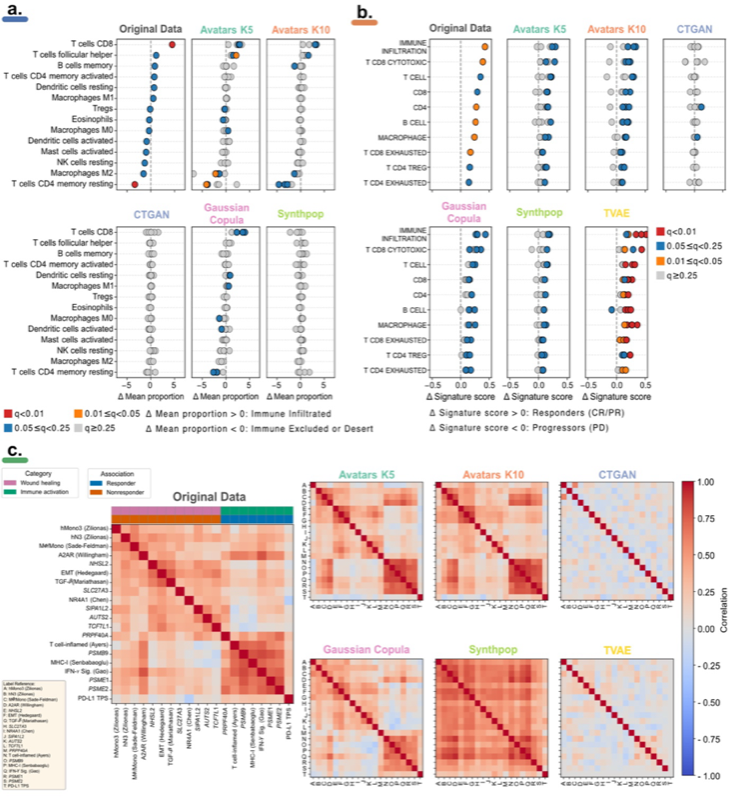

# Cell Type Deconvolution

## Introduction

Cell type deconvolution evaluates whether immune cell composition inferred from bulk RNA-seq data can be faithfully preserved in synthetic datasets. We employ CIBERSORTx with the LM22 reference signature matrix to estimate the relative proportions of 22 human immune cell types across original and synthetic cohorts. Given the compositional nature of immune cell fractions (which sum to 1), similarity between original and synthetic immune landscapes is quantified using the Aitchison distance—a metric specifically designed for compositional data on the simplex.

## Methodology

### Aitchison Distance

The Aitchison distance measures dissimilarity between probability distributions on the simplex, making it appropriate for compositional data such as immune cell fractions. Unlike Euclidean distance, it accounts for the relative nature of cell proportions and the constraint that fractions must sum to unity. Lower Aitchison distance indicates better preservation of the immune landscape between original and synthetic datasets.

For each synthetic data generation method, we compute the Aitchison distance between the CIBERSORTx-estimated immune cell composition profiles of the original and synthetic cohorts. This metric provides a global measure of how well the multivariate immune landscape is preserved across the entire sample space.

## Results



Figure 7: Evaluation of cell type deconvolution preservation. Aitchison distance measures the similarity of immune cell compositions estimated by CIBERSORTx between original and synthetic datasets.

### Global Performance

Across all three cohorts (ccRCC, Melanoma, NSCLC), synthetic data generation methods showed a clear decline in performance when moving from ccRCC to Melanoma and NSCLC. The highest overall Aitchison similarity for ccRCC was achieved by Synthpop (0.816 ± 0.057), with Gaussian Copula as a close second (0.798 ± 0.079). Avatars K10 achieved comparable results in ccRCC (0.756 ± 0.038) and displayed a mild decrease in Melanoma and NSCLC, whereas high inter-replicate variation was observed for Avatars K5. In contrast, TVAE and CTGAN produced consistently lower Aitchison similarity scores across all cohorts. Pairwise Bayesian estimation ranked Synthpop as the best method globally, with Gaussian Copula and Avatars being second best depending on the cohort.

### Differential Analysis

Beyond global concordance, we evaluated whether immune-related biological signals could be recovered in synthetic data. Using CIBERSORTx-based LM22 deconvolution, differential analysis between immune-infiltrated and immune-excluded/desert tumors in the ccRCC cohort identified enrichment of CD8+ T cells, follicular helper T cells, activated CD4+ memory T cells, and M1 macrophages in infiltrated tumors. In contrast, excluded/desert tumors exhibited higher proportions of M2/M0 macrophages, resting CD4+ memory T cells, resting NK cells, and eosinophils.

Among the synthetic data generation methods, only Avatars and Gaussian Copula managed to reconstruct immune contrasts at a near significance level (Wilcoxon rank-sum test, FDR Q < 0.25). Of note, synthetic replicate reproducibility was achieved only for cell types that already had very strong significance in the original data (Wilcoxon rank-sum test, FDR Q < 0.05), such as CD8+ T cells and resting CD4+ memory T cells. For all other cell types, which showed weaker or non-significant effects in the original cohort, the corresponding synthetic results were not robust and varied substantially between replicates.

In Melanoma and NSCLC, differential analyses between responders and non-responders revealed no significant immune cell enrichment patterns that could be consistently recovered in synthetic datasets.

## Observations

- Synthpop achieved the highest Aitchison similarity for the ccRCC cohort (0.816 ± 0.057), demonstrating superior preservation of immune cell composition in kidney cancer datasets.
- Gaussian Copula consistently ranked as the second-best method across all cohorts, with particularly strong performance in ccRCC (0.798 ± 0.079).
- Performance declined systematically from ccRCC to Melanoma to NSCLC across all methods, suggesting that immune landscape complexity varies by cancer type.
- Only Avatars and Gaussian Copula reconstructed biologically meaningful immune contrasts in differential analysis, but reproducibility was limited to strongly significant cell types in the original data (FDR Q < 0.05).
- TVAE and CTGAN methods showed consistently lower Aitchison similarity across all cohorts, indicating difficulty in preserving the multivariate immune landscape structure.

## References

The cell type deconvolution analysis was implemented using the following scripts and notebooks:

- Analysis notebook: `Manuscripts/Melanoma/NarrowUtility/CellDecovo/AitchisonDistance_final.ipynb`
- Differential analysis script: `Manuscripts/Melanoma/NarrowUtility/CellDecovo/CellDecovolution_DifferentialAnalysis.py`
- Helper script: `Manuscripts/Melanoma/NarrowUtility/CellDecovo/calculate_immune_signature.py`

## Code Example

The following code demonstrates how to execute cell deconvolution-based evaluation using the SynOmicBench API.

```python
import pandas as pd
from synomicbench.evaluation import DeconvolutionEvaluator
from synomicbench.datasets import load_tcga_dataset

# Load the original and synthetic transcriptomic data
original_data = load_tcga_dataset("SKCM", type="original")  # Melanoma data
synthetic_data = load_tcga_dataset("SKCM", type="avatar")

# Initialize the evaluator for cell deconvolution
# We use the 'cibersort' method by default, targeting immune cell types
evaluator = DeconvolutionEvaluator(
    method="cibersort",
    signature="LM22",
    normalize_output=True
)

# Run the deconvolution and evaluation pipeline
# This calculates estimated cell proportions and compares them
results = evaluator.evaluate(original_data, synthetic_data)

# Print summary metrics for key immune cell types
print("Correlation of cell fractions (Original vs. Synthetic):")
for cell_type in ["T cells CD8", "B cells naive", "Macrophages M1"]:
    correlation = results['metrics'][cell_type]['pearson_corr']
    print(f"  {cell_type}: {correlation:.4f}")

# Plot the comparison of estimated immune landscapes
# This creates a stacked bar chart or grouped boxplots
results.plot_proportion_comparison(
    cell_types=["T cells CD8", "T cells CD4 naive", "NK cells resting"],
    plot_type="boxplot",
    save_path="immune_landscape_comparison.png"
)

# Export the estimated cell proportions for both datasets
results.original_proportions.to_csv("original_immune_fractions.csv")
results.synthetic_proportions.to_csv("synthetic_immune_fractions.csv")
```

By subjecting synthetic datasets to cell deconvolution analysis, SynOmicBench provides a deep, biologically-relevant validation that goes far beyond simple statistical similarity, ensuring the clinical relevance of synthetic transcriptomic data.
