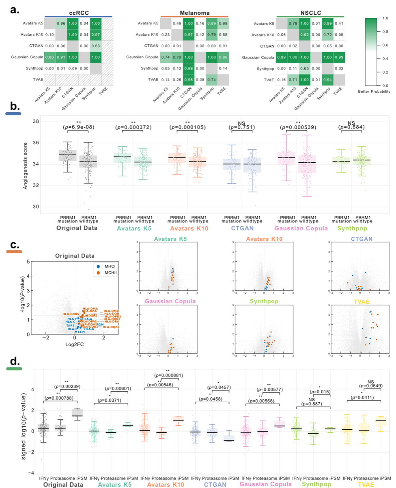

# Differential Gene Expression (DGE) Analysis

Differential Gene Expression (DGE) analysis is a cornerstone of transcriptomics research, used to identify genes that show statistically significant changes in expression between different biological conditions (e.g., healthy vs. diseased, treated vs. untreated). In the context of SynOmicBench, DGE preservation is a critical metric for "narrow utility," as it measures whether synthetic data can replicate the biological signals necessary for discovery and hypothesis generation.

## Overview

The goal of evaluating DGE in synthetic data is to determine if a synthetic dataset preserves the same set of differentially expressed genes (DEGs) as the original data. This involves not only matching the gene names but also maintaining the direction and magnitude of the expression changes (log2 fold changes) and the statistical significance (p-values/q-values).

SynOmicBench utilizes a standardized DGE workflow, typically involving tools like DESeq2 or edgeR for count data, or linear models for normalized expression values. The benchmarking framework compares the results obtained from real data against those from various synthetic counterparts.

## Methodology

The evaluation of DGE preservation in SynOmicBench follows a systematic approach:

1.  **Selection of Biological Contrast**: A specific comparison is chosen from the original dataset (e.g., immunotherapy responders vs. non-responders in the Melanoma dataset).
2.  **DGE Calculation**: DGE analysis is performed on the original data and each synthetic dataset using identical parameters.
3.  **Rank Score Computation**: For each gene, a rank score is calculated as:
    $$RankScore = sign(Log2FC) \times -\log_{10}(Q\text{-value})$$
    This score captures both the direction and the strength of the differential signal.
4.  **Concordance Assessment**: The rank scores from synthetic data are compared against the original data. SynOmicBench introduces the **Gene-set Concordance Score (GCS)** (conceptually similar to the Pathway Concordance Score) to quantify this agreement.
5.  **Visualization**: Scatter plots of rank scores (Original vs. Synthetic) are generated, divided into significance zones:
    *   **Zone 1 & 2**: Concordant non-significant genes (Lower-Left and Upper-Right).
    *   **Zone 3 & 4**: Concordant significant genes (Lower-Left and Upper-Right).
    *   **Discordant Zones**: Genes that are significant in one dataset but not the other, or show opposite directions of change.

## Benchmark Results

Evaluation across multiple cohorts (ccRCC, Melanoma, NSCLC) reveals distinct performance patterns among synthesis methods:



*Figure 4: Comparison of Differential Gene Expression preservation across synthesis methods. Panels show the correlation of gene rank scores between real and synthetic datasets.*

### Key Findings

!!! success "Top Performers"
    **Gaussian Copula** and **Synthpop** consistently demonstrate the highest fidelity in preserving DGE patterns. These methods excel at capturing the univariate distributions and the primary biological signals required for DGE.

!!! note "The Deep Learning Challenge"
    Deep learning methods like **CTGAN** and **TVAE** often struggle to preserve fine-grained DGE signals. While they may capture broad distributional properties, the specific gene-gene relationships and subtle expression shifts required for DGE are frequently dampened or lost during the adversarial training or latent space compression.

!!! info "Stability"
    Statistical methods generally show higher stability across different random seeds compared to deep learning approaches, making them more reliable for "narrow" biological tasks.

## Code Example

The `GCSAnalyzer` class in SynOmicBench provides a streamlined way to evaluate DGE preservation.

```python
import pandas as pd
from SynOmics.metrics.narrow_utility.DGE import GCSAnalyzer

# Load DGE results (e.g., from DESeq2)
dge_real = pd.read_csv("dge_results_real.csv")
dge_syn_path = "dge_results_synthetic.csv"

# Initialize the analyzer
# term_col: gene names, nes_col: Log2FC, q_col: adjusted p-value
analyzer = GCSAnalyzer(
    term_col="Gene", 
    nes_col="Log2FC", 
    q_col="Q_value", 
    q_thr=0.05
)

# Process the results
(x, y, gcs, n1, n2, n3, n4, m, ori_size, aligned_size, seed) = \
    analyzer.process_single_gsea_result(dge_real, dge_syn_path)

print(f"Gene-set Concordance Score: {gcs:.3f}")
print(f"Significant concordant genes: {n3 + n4}")
```

This analysis ensures that synthetic data remains biologically "fit for purpose," allowing researchers to perform preliminary analyses on synthetic data with confidence that their findings will translate back to the original biological context.
