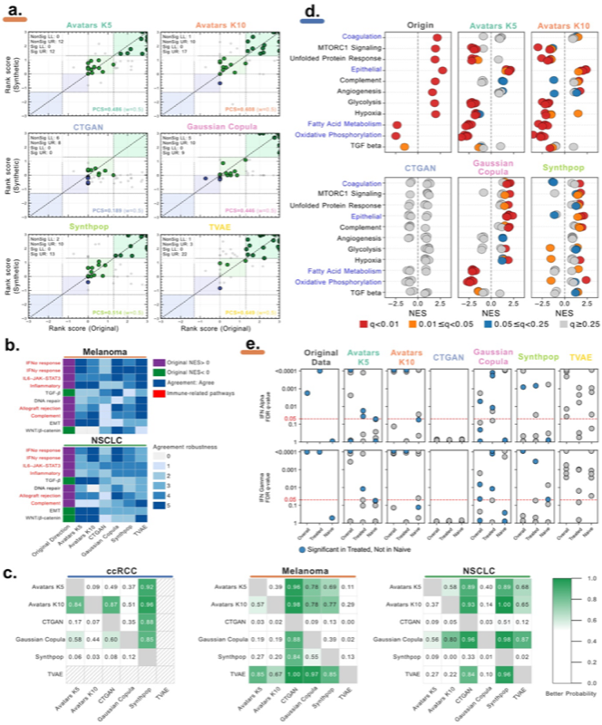

# Gene Set Enrichment Analysis (GSEA)

Gene Set Enrichment Analysis (GSEA) is a powerful tool for identifying biological processes, pathways, or gene sets that are coordinately regulated in response to a biological stimulus or condition. Unlike Differential Gene Expression (DGE) analysis, which focuses on individual genes, GSEA considers entire functional units of biology, making it more robust to individual gene variability and more informative about the biological mechanism.

## Overview

In SynOmicBench, GSEA preservation is a key "narrow utility" metric. It assesses whether synthetic data can replicate the higher-level biological signals and pathway-level regulatory structures present in the original dataset. Evaluating GSEA in synthetic data is inherently more challenging than DGE because it depends on the complex, multivariate correlation structure of thousands of genes.

The benchmark compares the enrichment results (e.g., Normalized Enrichment Scores, NES) between real and synthetic data, ensuring that biological "storylines" remain intact for researchers working with synthetic data.

## Methodology

The evaluation of GSEA in SynOmicBench follows a rigorous pipeline:

1.  **Selection of Biological Contrast**: Identical to the DGE evaluation, a biological comparison of interest is defined (e.g., immunotherapy treated vs. naive patients in the Melanoma cohort).
2.  **GSEA Computation**: Analysis is performed using standard packages like **fgsea**, with genes ranked by their differential expression signal (e.g., Wald statistic or Log2FC).
3.  **Pathway Concordance Score (PCS)**: SynOmicBench introduces the PCS to quantify the agreement between real and synthetic GSEA results.
    *   **Rank Score Calculation**: For each pathway, a rank score is calculated:
        $$RankScore = sign(NES) \times -\log_{10}(Q\text{-value})$$
    *   **Alignment**: Original and synthetic results are matched by pathway names (inner join).
    *   **PCS Formula**: The PCS measures the proportion of concordant pathways, weighted by significance:
        $$PCS = \frac{N_{sign} + w \times N_{non\text{-}sign}}{M}$$
        Where $N_{sign}$ is the number of concordant significant pathways, $N_{non\text{-}sign}$ is the number of concordant non-significant pathways, $w$ is a weight factor (typically 0.5), and $M$ is a normalization constant based on the original significant pathways.
4.  **Visualization**: Scatter plots of PCS results are generated, identifying concordant and discordant pathways across different significance zones.

## Benchmark Results

Evaluation across multiple cohorts (ccRCC, Melanoma, NSCLC) demonstrates that preserving pathway biology requires more than just statistical fidelity.



*Figure 5: Evaluation of Gene Set Enrichment Analysis preservation. The Pathway Concordance Score (PCS) measures the agreement between original and synthetic enrichment results.*

### Key Findings

!!! success "Top Performers"
    **Avatars** (both K5 and K10) and **Gaussian Copula** demonstrate the strongest performance in GSEA preservation. These methods excel at capturing the multivariate dependencies and gene-gene correlations that define biological pathways.

!!! note "The Correlation Challenge"
    Methods like **Synthpop**, which focus on univariate distributions, may perform well on individual gene DGE but often fall short on GSEA. This is because they do not always preserve the necessary correlation structure between genes that belong to the same functional pathway.

!!! failure "Deep Learning Performance"
    Deep learning methods like **CTGAN** and **TVAE** often struggle with GSEA. The enrichment signal is frequently lost, suggesting that the subtle coordination of gene sets is not adequately captured during the training process of these models.

## Code Example

The `PCSAnalyzer` class in SynOmicBench provides a streamlined interface for computing the Pathway Concordance Score.

```python
import pandas as pd
from SynOmics.metrics.narrow_utility.GSEA import PCSAnalyzer

# Load GSEA results (e.g., output from fgsea)
gsea_real = pd.read_csv("gsea_results_real.csv")
gsea_syn_path = "gsea_results_synthetic.csv"

# Initialize the analyzer
# term_col: pathway names, nes_col: NES, q_col: FDR q-value
analyzer = PCSAnalyzer(
    term_col="Term", 
    nes_col="NES", 
    q_col="FDR q-val", 
    q_thr=0.05, 
    w=0.5
)

# Process the results
x, y, result = analyzer.process_single_gsea_result(gsea_real, gsea_syn_path)

print(f"Pathway Concordance Score (PCS): {result.pcs:.3f}")
print(f"Significant concordant pathways: {result.n_sign}")
print(f"Aligned pathway size: {result.aligned_size}")
```

This analysis ensures that synthetic data remains biologically valid at a systems level, allowing researchers to explore pathway-level hypotheses with the same confidence they would have with the original data.
