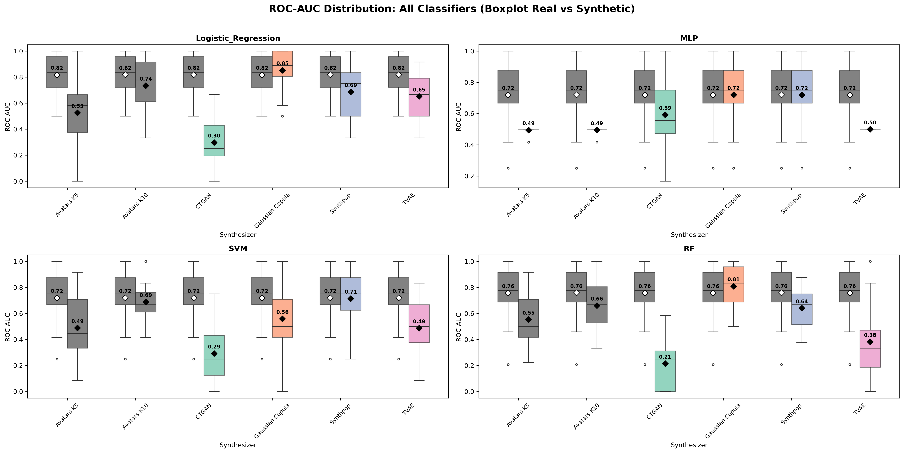

# Predictive Modeling Validation

SynOmicBench evaluates the predictive utility of synthetic data through a framework comparing the performance of machine learning models trained on synthetic data versus real data. This ensures that synthetic datasets are suitable for training models that generalize to real-world clinical tasks.

## Overview

The predictive modeling module uses cross-validation techniques to compare how well models learn clinical features from original and synthetic data. A high-performing synthetic dataset should produce models that perform similarly to those trained on the original data when both are tested on real samples.

### Key Metrics

- **Train-on-Synthetic-Test-on-Real (TSTR)**: Trains a model on synthetic data and evaluates it on real test data. This is the primary measure of utility.
- **Train-on-Real-Test-on-Synthetic (TRTS)**: Trains on real data and evaluates on synthetic. This measures distributional similarity.
- **Cross-Validation Score (CV-Score)**: The average performance (e.g., ROC-AUC or F1-score) over multiple folds.
- **Wilcoxon P-value**: A statistical test determining if the difference between original and synthetic scores is significant across CV folds.

## Methodology

The `compare_cross_validation` function provides the core logic for these benchmarks:

1. **Stratified K-Fold CV**: Both datasets are split into $K$ folds to ensure balanced target distributions.
2. **Parallel Evaluation**: For each fold, models are trained on:
    - Real training data (Reference).
    - Synthetic training data (Utility check).
3. **Common Test Set**: Both models are evaluated on the **same real test fold** to ensure a fair comparison.
4. **Scoring**: Metrics like `roc_auc`, `accuracy`, and `f1` are calculated per fold.
5. **Comparison**: The results include fold-level scores, an "improvement" flag, and a p-value for significance.

### Predictive Performance Stability

Synthetic data utility is highly dependent on the "balance" of the synthesis model. Methods that capture multivariate correlations (e.g., Gaussian Copula) typically produce models with lower variance across folds compared to deep generative models (e.g., CTGAN) which may require more samples to learn stable decision boundaries.

## Benchmark Results

Benchmark results across various clinical datasets (ccRCC, Melanoma, NSCLC) yield several key findings:

- **Correlation with Utility**: TSTR performance strongly correlates with broad utility metrics like pairwise correlation preservation.
- **Top Synthesizer**: **Gaussian Copula** often matches or exceeds original performance in small clinical datasets (TSTR score $\geq 95\%$ of original).
- **Deep Learning Performance**: Models like **TVAE** and **CTGAN** show promising results but can exhibit higher performance variance, particularly in high-dimensional omic spaces.
- **Generalization**: Synthetic data often acts as a form of regularization, sometimes producing models that generalize slightly better to real test sets than models trained on the original data alone.

### Key Findings
!!! success "TSTR as the Ultimate Utility Metric"
    Synthetic data that supports high TSTR performance is "validated" for downstream predictive research.

!!! tip "Model Generalization"
    In some cases, synthetic data can be used as a data augmentation strategy to improve the robustness of clinical prediction models.

## Visualization

The predictive utility is often visualized through boxplots comparing CV scores across different synthesizers.


*Typical benchmark output showing ROC-AUC performance for TSTR across multiple datasets and synthesizers.*

## Code Example

The following example shows how to compare predictive performance using the `compare_cross_validation` utility.

```python
from sklearn.ensemble import RandomForestClassifier
from sklearn.model_selection import StratifiedKFold
from SynOmics.metrics.narrow_utility.predictive_model_comp import compare_cross_validation

# Setup parameters
model = RandomForestClassifier(n_estimators=100, random_state=42)
cv = StratifiedKFold(n_splits=5, shuffle=True, random_state=42)
target = "Benefit"
metric = "roc_auc"

# Compare real vs synthetic
results = compare_cross_validation(
    real=real_df,
    synth=gc_df,
    target_col=target,
    model=model,
    cv=cv,
    metric=metric,
    n_jobs=-1
)

# Output results
print(f"Real Mean Score: {np.mean(results['real_scores']):.3f}")
print(f"Synthetic (TSTR) Mean Score: {np.mean(results['synthetic_scores']):.3f}")
print(f"P-value: {results['p_value']:.4g}")
```

## Significance in Precision Medicine

The ability to train predictive models on synthetic data is essential for collaborative precision medicine. It allows researchers to:
- Share "prediction-ready" synthetic datasets without exposing private patient information.
- Benchmark new ML architectures on realistic multi-omic data.
- Validate clinical scoring systems on diverse, synthetic cohorts.
