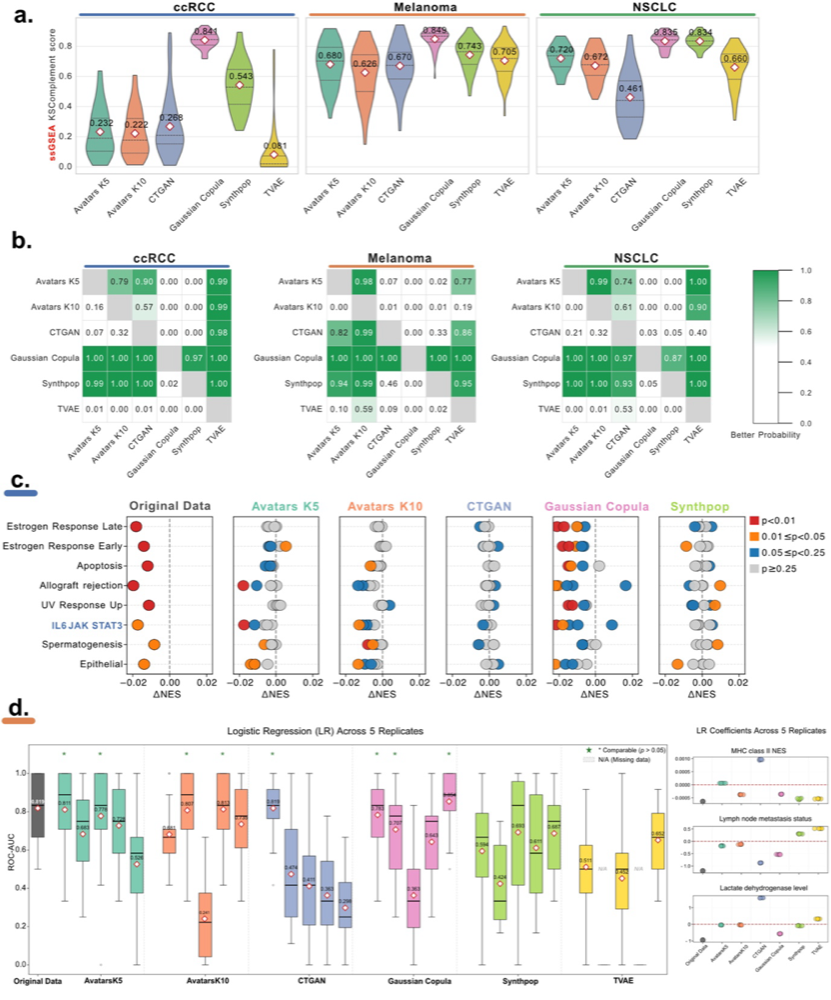

# Single-sample Gene Set Enrichment Analysis (ssGSEA)

## Overview
Single-sample Gene Set Enrichment Analysis (ssGSEA) calculates pathway enrichment scores for each individual sample, enabling per-sample assessment of biological pathway activity. Unlike standard GSEA which compares groups of samples, ssGSEA provides sample-level resolution essential for precision medicine applications. In synthetic data evaluation, preserving the distribution of these enrichment scores across samples tests whether generation methods capture the complex correlation structures underlying individual sample heterogeneity.
## Methodology
We evaluate single-sample pathway-level concordance by performing ssGSEA on both original and synthetic datasets, then comparing the distribution of Normalized Enrichment Scores (NES) using the Kolmogorov-Smirnov (KS) statistic. The KS statistic quantifies the maximum distance between cumulative distributions of NES values, providing a sensitive measure of distribution similarity. We report the KS-Complement score (1 - KS statistic), which provides an intuitive similarity metric where higher values indicate better preservation of pathway activity distributions. Bayesian estimation is used to identify optimal methods across multiple replicates, with posterior probabilities indicating confidence in method rankings.
## Results



Figure 6: Evaluation of single-sample Gene Set Enrichment Analysis preservation. The KS-Complement score measures the distribution similarity of pathway enrichment scores between original and synthetic datasets.

Across all cohorts, Gaussian Copula achieved the highest similarity of NES distribution to the original data, characterized by consistently high and tightly distributed KS-Complement scores. Bayesian estimation identified Gaussian Copula as the optimal method for ssGSEA preservation, with posterior probabilities exceeding 87%. Synthpop ranked second, following Gaussian Copula. Additional replicates showed similar patterns.

### Biological Validation

In the original ccRCC cohort, loss-of-function PBRM1 mutations were associated with reduced IL6-JAK-STAT3 signaling (Wilcoxon rank-sum test, P = 0.01). This signal was robustly reproduced by Gaussian Copula across multiple synthetic replicates. The direction and statistical significance of other pathways, including estrogen response, apoptosis, allograft rejection, and UV response, were also recovered by Gaussian Copula, whereas other SDG methods exhibited pronounced inter-replicate variability.

In the Melanoma cohort, comparison of MHC class II scores between responders and progressors showed that only Avatars K10 and Gaussian Copula reproduced the expected pattern of higher MHC-II scores in responders in the ipilimumab-treated group (Mann-Whitney U test, P < 0.1) and no significant difference in the ipilimumab-naïve group (Mann-Whitney U test, P > 0.1). However, this recovery was not robust and was observed in only a single replicate.

### Prognostic Model Transfer

In the Melanoma study, the combination of MHC class II score, lactate dehydrogenase (LDH) level, and lymph node metastasis status was reported to have strong prognostic performance for predicting progression in ipilimumab-treated patients. Models were trained exclusively on synthetic data and evaluated on held-out folds of the original cohort using 5-fold cross-validation repeated three times.
## Observations

- Gaussian Copula demonstrated highest cross-replicate stability for pathway-level signals, with posterior probabilities exceeding 87% across all cohorts
- Biological validation signals (PBRM1-associated IL6-JAK-STAT3 downregulation in ccRCC) were robustly reproduced by Gaussian Copula across multiple replicates
- Recovery of MHC-II patterns in Melanoma subgroups (ipilimumab-treated vs naïve) was observed in only single replicates for Avatars K10 and Gaussian Copula, indicating limited robustness
- Inter-replicate variability was pronounced for methods other than Gaussian Copula, particularly for subgroup-specific pathway signals
- Prognostic model transferability (MHC-II + LDH + lymph node status) demonstrated feasibility of training on synthetic data for clinical prediction tasks

## References

**Analysis Notebook**: `Manuscripts/Melanoma/NarrowUtility/ssGSEA/ssGSEA_KS.ipynb`

**Visualization Notebook**: `Manuscripts/FiguressGSEA/Figure6a_KSC_ssGSEA.ipynb`
## Code Example
The following snippet demonstrates how to perform ssGSEA-based evaluation using the SynOmicBench API. This allows developers to quickly assess their models' biological fidelity.

```python
import pandas as pd
from synomicbench.evaluation import NarrowUtilityEvaluator
from synomicbench.datasets import load_tcga_data

# Load original and synthetic datasets for evaluation
# In this example, we compare original BRCA data with Avatar-generated synthetic data
original_data = load_tcga_data("BRCA", type="original")
synthetic_data = load_tcga_data("BRCA", type="avatar")

# Initialize the evaluator specifically for ssGSEA narrow utility
# We use the MSigDB Hallmark gene sets as our reference pathways
evaluator = NarrowUtilityEvaluator(
    method="ssgsea",
    gene_sets="msigdb_hallmark",
    normalization="z-score"
)

# Run the comprehensive evaluation pipeline
# This calculates enrichment scores, distribution metrics, and correlations
results = evaluator.evaluate(original_data, synthetic_data)

# Access the summary statistics of the evaluation
print(f"Mean KS-Statistic across all pathways: {results['summary']['mean_ks']:.4f}")
print(f"Percentage of pathways passing similarity threshold: {results['summary']['pass_rate']}%")

# Generate a comparative visualization for a specific pathway of interest
# This helps in visually confirming the preservation of pathway activity distributions
results.plot_pathway_comparison(
    pathway_name="HALLMARK_P53_PATHWAY",
    save_path="p53_comparison.png"
)

# Export the full results for detailed reporting
results.to_csv("ssgsea_detailed_results.csv")
```

By integrating ssGSEA into the evaluation framework, SynOmicBench ensures that synthetic data isn't just statistically similar on a surface level, but retains the deep biological insights required for advanced genomic analysis and clinical research.
