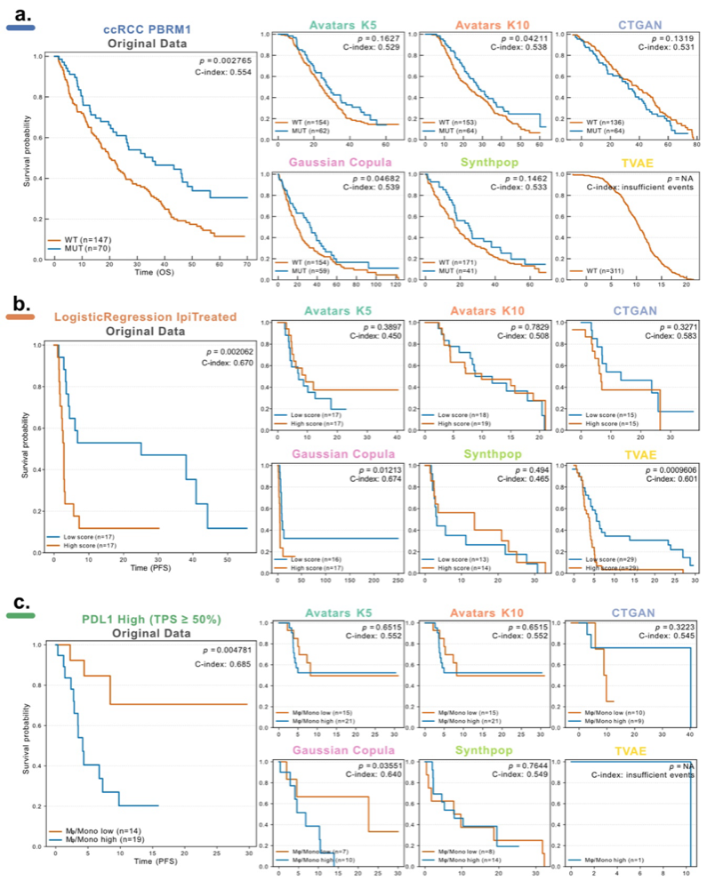

# Survival Analysis

Survival analysis evaluates whether synthetic data preserves clinically meaningful survival patterns by comparing Overall Survival (OS) and Progression-Free Survival (PFS) between treatment responders and non-responders. This validation is critical for biomedical research, where synthetic datasets must support the same survival-based discoveries as real data without compromising patient privacy.

SynOmicBench quantifies survival discrimination using the concordance index (C-index) derived from Cox proportional hazards models and compares Kaplan-Meier survival curves between original and synthetic datasets using log-rank tests.

## Methodology

Survival discrimination is quantified using Cox proportional hazards models fitted separately on original and synthetic datasets for both OS and PFS. The **C-index score** measures similarity between datasets based on the absolute difference between original and synthetic C-indices (averaged across OS and PFS):

$$\text{C-index score} = 1 - |C_{\text{orig}} - C_{\text{syn}}|$$

Higher values indicate greater agreement in discrimination performance. In parallel, Kaplan-Meier survival differences between responder groups are assessed using the **log-rank test**. Survival curves are visualized in a grid format comparing original data with synthetic replicates across different SDG methods.

## Results



**Figure 8. Survival signal preservation and clinical risk stratification in synthetic cohorts.** a) PBRM1-associated overall survival in ccRCC (blue strip) comparing PBRM1-mutant (blue) and wild-type (orange) groups across SDG methods. b) Preservation of survival stratification based on a predictive model in the ipilimumab-treated Melanoma cohort (orange strip) with progression-free survival stratified by predicted risk groups (low risk: blue; high risk: orange). c) Patient stratification using a macrophage/monocyte signature in the PD-L1 high NSCLC cohort (green strip) evaluating progression-free survival differences between tumors with low (orange) versus high (blue) macrophage/monocyte signature scores within the PD-L1 high (TPS ≥ 50%) subgroup. Log-rank P values and C-indices are reported in each panel.

### Performance Across Cancer Cohorts

Two distinct performance clusters were observed across datasets. **Avatars (K5/K10)** and **Gaussian Copula** consistently achieved high C-index scores (>0.9), indicating close concordance between original and synthetic survival discrimination. In contrast, **CTGAN**, **Synthpop**, and **TVAE** yielded lower scores (<0.9), suggesting incomplete preservation of survival-related signals. Performance was stable across random seeds, as reflected by small standard deviations of C-index scores.

**ccRCC Cohort**: Avatars (K5/K10) and Gaussian Copula preserved significant differences between responders and non-responders for both OS (log-rank test, Avatars K5: P < 0.01, Avatars K10: P < 0.01, Gaussian Copula: P < 0.01) and PFS (log-rank test, Avatars K5: P < 0.01, Avatars K10: P < 0.01, Gaussian Copula: P < 0.01). CTGAN retained significance for OS only (log-rank test, P = 0.0167), whereas Synthpop preserved significance for PFS only (log-rank test, P = 0.0358), indicating partial recovery of survival signals. TVAE was excluded from this cohort because it generated only a single treatment label (Intermediate clinical benefit-ICB) across replicates.

**Melanoma Cohort**: Avatars and Gaussian Copula maintained significant OS (log-rank test, Avatars K5: P < 0.01, Avatars K10: P < 0.01, Gaussian Copula: P < 0.01) and PFS (log-rank test, Avatars K5: P < 0.01, Avatars K10: P < 0.01, Gaussian Copula: P < 0.01) separation consistent with the original data. TVAE also produced statistically significant differences (log-rank test, OS and PFS: P < 0.01); however, it markedly distorted the responder-to-non-responder ratio (84% vs. 10% in the original cohort), indicating label imbalance despite apparent discrimination. CTGAN and Synthpop did not preserve significant OS or PFS differences (log-rank test, OS and PFS: P > 0.05).

**NSCLC Cohort**: Avatars and Gaussian Copula again retained significant separation for both OS and PFS (log-rank test, P < 0.01), whereas CTGAN, Synthpop, and TVAE failed to maintain survival discrimination for either endpoint (log-rank test, OS and PFS P > 0.05).

### Biomarker Stratification Preservation

We evaluated whether synthetic datasets preserved biomarker stratification patterns previously reported in prior studies. Three clinically relevant survival signatures were assessed:

**PBRM1-Associated Survival in ccRCC**: Braun et al. demonstrated that somatic alterations modulated response to PD-1 blockade in ccRCC, with patients harboring PBRM1 alterations exhibiting improved outcomes compared with wild-type cases. This genotype-outcome association was faithfully recapitulated in synthetic data generated by **Avatars K10** and **Gaussian Copula** (Figure 8a, log-rank test, Avatars K10: P < 0.05, Gaussian Copula: P < 0.05), indicating effective preservation of mutation-linked survival dependencies.

**MHC-II Prognostic Model in Melanoma**: Liu et al. developed a parsimonious predictive model integrating MHC-II ssGSEA scores with genomic features to stratify progressors and non-progressors, where patients with lower predicted risk scores achieved better survival outcomes. We re-implemented this modeling framework using classifiers trained on synthetic datasets. Notably, only the **Gaussian Copula** synthetic dataset consistently reproduced this survival separation for both PFS (Figure 8b, log-rank test, P < 0.05) and OS (log-rank test, P < 0.05). TVAE showed preservation for PFS (Figure 8b, log-rank test, P < 0.01), but could not preserve OS stratification (log-rank test, P > 0.05).

**Macrophage/Monocyte Signature in NSCLC**: Within the NSCLC cohort, Ravi et al. reported that among patients with high PD-L1 expression (TPS ≥ 50%), increased macrophage/monocyte infiltration was associated with reduced PFS despite otherwise favorable prognostic status. This clinically relevant survival signature was again successfully recovered using **Gaussian Copula** synthetic data (Figure 8c, log-rank test, P < 0.05), whereas none of the other SDG methods reproduced this association.

Collectively, while Gaussian Copula and Avatars (K5/K10) effectively preserved global survival relationships between OS, PFS, and treatment response, only Gaussian Copula consistently retained downstream clinically interpretable stratification patterns across multiple oncology datasets.

## Observations

- Avatars (K5/K10) and Gaussian Copula consistently achieved C-index scores >0.9 across all three cancer cohorts, indicating close agreement with original survival discrimination performance
- CTGAN, Synthpop, and TVAE yielded lower C-index scores (<0.9) and frequently failed to maintain statistically significant survival separation between responder groups
- TVAE generated extreme label imbalance in the Melanoma cohort (84% vs. 10% responder ratio) despite producing statistically significant survival differences, highlighting the importance of examining class distributions in synthetic data
- Only Gaussian Copula consistently preserved all three clinically validated biomarker stratification patterns: PBRM1-associated survival in ccRCC, MHC-II prognostic model in Melanoma, and macrophage/monocyte signature in NSCLC
- Partial preservation was observed with some methods: CTGAN maintained OS significance only in ccRCC, Synthpop preserved PFS significance only in ccRCC, and Avatars K10 recovered PBRM1-associated survival in ccRCC
- Performance stability across random seeds was high for correlation-based methods (Gaussian Copula, Avatars), as reflected by small standard deviations in C-index scores

## References

- Analysis notebook: `Manuscripts/Melanoma/NarrowUtility/SA/SurvivalAnalysis.ipynb`
- Source module: `src/SynOmics/metrics/narrow_utility/survival_analysis.py`
- Experiment script: `Manuscripts/Melanoma/NarrowUtility/SA/SurvivalAnalysis.py`

## Code Example

The `SurvivalEvaluator` class provides a high-level API for comparing survival curves and computing C-index scores across multiple datasets.

```python
from SynOmics.metrics.narrow_utility.survival_analysis import SurvivalEvaluator

# Define datasets and comparison groups
datasets = {
    "Origin": real_df,
    "Gaussian Copula": gc_df,
    "CTGAN": ctgan_df,
    "Avatars K5": avatars_k5_df,
    "Avatars K10": avatars_k10_df
}

# Define phenotype comparison: Responder vs Non-Responder
phenotype = {"Benefit": ["Responder", "Non-Responder"]}

# Initialize evaluator for Overall Survival (OS)
evaluator = SurvivalEvaluator(
    datasets_dict=datasets,
    phenotype=phenotype,
    time_target="OS",
    event_target="OS_CNSR"
)

# Compute survival metrics
summary_df = evaluator.compute_survival_metrics()
scored_df = evaluator.compute_cindex_scores()

# Plot Kaplan-Meier survival curves in grid format
fig, _ = evaluator.plot_grid(figsize=(15, 5))
fig.savefig("survival_benchmark.png", dpi=300)

# Display C-index scores
print(scored_df)
```
