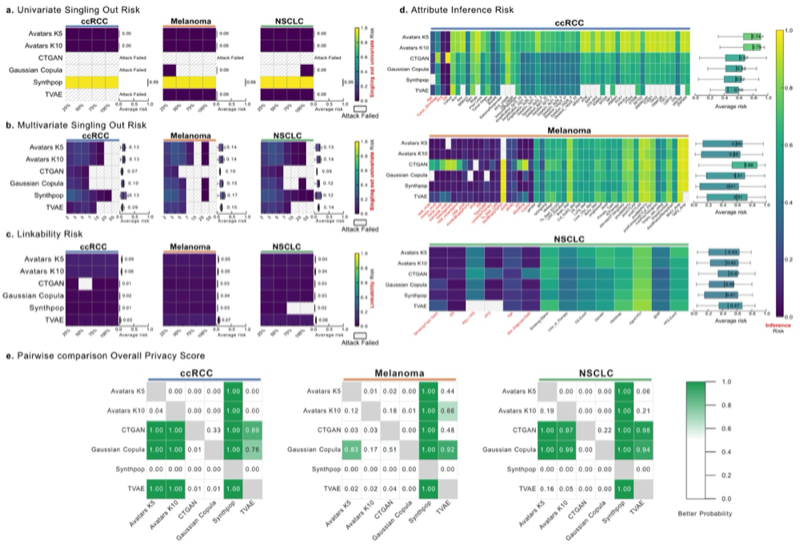

# Privacy Risk Assessment

Privacy is a critical dimension in the synthesis of omic and clinical data. SynOmicBench evaluates privacy risks following the principles outlined by the European Data Protection Board (EDPB), focusing on the three primary risks that successful anonymization must mitigate: Singling-Out, Linkability, and Inference.

## Privacy Metrics

We employ the `anonymeter` framework to quantify these risks, ensuring that synthetic datasets do not inadvertently reveal sensitive information about individuals in the original cohort.

### 1. Singling-Out
Singling-out occurs when an attacker can identify a single individual in the dataset based on a combination of attributes. Even if names or direct identifiers are removed, unique combinations of clinical and molecular features (e.g., a specific rare mutation combined with an exact age and diagnosis date) can isolate an individual record.

### 2. Linkability
Linkability is the ability to connect two or more records relating to the same individual, either within the same dataset or across different datasets. In the context of multi-omics, linkability risk assessment evaluates whether an attacker can reconnect split datasets (e.g., connecting a clinical record to its corresponding transcriptomic profile) using the synthetic data as a bridge.

### 3. Inference
Inference risk refers to the possibility of deducing the value of a sensitive attribute with high probability by observing other attributes in the dataset. For example, if a synthetic model learns a strong correlation between certain gene expression levels and a specific clinical outcome, an attacker might infer a patient's sensitive health status by observing their gene expression.

---

## Benchmark Results

Our evaluation across multiple cancer types (ccRCC, Melanoma, NSCLC) reveals distinct privacy-utility trade-offs among different synthesis methods.

### Overall Privacy Scores
The following table summarizes the overall privacy scores across five different seeds. Higher scores indicate lower privacy risk (better protection).

| Method | Seed 0 | Seed 1 | Seed 2 | Seed 3 | Seed 42 | Mean |
| :--- | :---: | :---: | :---: | :---: | :---: | :---: |
| **Avatars K5** | 0.771 | 0.767 | 0.773 | 0.777 | 0.771 | 0.772 |
| **Avatars K10** | 0.769 | 0.774 | 0.777 | 0.783 | 0.776 | 0.776 |
| **CTGAN** | 0.931 | 0.902 | 0.903 | 0.918 | 0.917 | 0.914 |
| **Gaussian Copula** | 0.856 | 0.862 | 0.867 | 0.866 | 0.897 | 0.870 |
| **Synthpop** | 0.633 | 0.666 | 0.611 | 0.618 | 0.659 | 0.637 |
| **TVAE** | 0.969 | 0.919 | 0.984 | 0.935 | 0.954 | 0.952 |

### Key Findings
- **Deep Learning Methods (TVAE, CTGAN):** These methods generally exhibit the highest privacy scores, suggesting robust protection against the tested attacks. However, this often comes at the cost of capturing complex biological correlations.
- **Gaussian Copula:** Provides a balanced trade-off, maintaining reasonable privacy while preserving essential statistical properties of the omic data.
- **K-anonymity based methods (Avatars):** Show consistent privacy levels across seeds, influenced by the parameter $k$.
- **Synthpop:** In its default configuration, Synthpop often showed higher privacy risks compared to other methods, particularly in datasets with many unique attribute combinations.

---

## Visualizing Privacy Risks

The following figures illustrate the risk profiles for different metrics and synthesizers.

### Privacy Risk Overview (Figure 9)

*Figure 9: Comprehensive assessment of privacy risks across different synthesizers.*

### Detailed Metric Distributions
The following plots from our evaluation notebooks provide deeper insights into the specific risks:

#### Overall Privacy Distribution

*Distribution of overall privacy scores across evaluated methods.*

#### Inference Risk

*Assessment of the probability of inferring sensitive attributes from synthetic data.*

#### Linkability Risk

*Evaluation of the risk of reconnecting records using synthetic data.*

#### Singling-Out Risk (Univariate)

*Risk of identifying unique records based on single attributes.*

---

## Code Example: Evaluating Privacy

You can evaluate the privacy risk of your synthetic data using the integrated `anonymeter` wrappers. Below is an example of how to compute linkability and singling-out risks.

```python
import pandas as pd
from anonymeter.evaluators import LinkabilityEvaluator, SinglingOutEvaluator

# Load original and synthetic data
ori_df = pd.read_csv("original_data.csv")
syn_df = pd.read_csv("synthetic_data.csv")

# 1. Evaluate Singling-Out Risk
# We use a subset of columns that an attacker might know
aux_cols = ['Age', 'Gender', 'Tumor_Stage']
so_eval = SinglingOutEvaluator(ori=ori_df, 
                               syn=syn_df, 
                               control=None, # Optional control group
                               n_attacks=500)
so_eval.evaluate(mode="multivariate")
so_risk = so_eval.risk()

print(f"Singling-out risk: {so_risk.value:.3f} (CI: {so_risk.low:.3f} - {so_risk.high:.3f})")

# 2. Evaluate Linkability Risk
# Attacker has two datasets with partial information
aux_cols_link = (['Age', 'Gender'], ['Tumor_Stage', 'Mutation_Count'])
li_eval = LinkabilityEvaluator(ori=ori_df, 
                               syn=syn_df, 
                               aux_cols=aux_cols_link,
                               n_attacks=500)
li_eval.evaluate()
li_risk = li_eval.risk()

print(f"Linkability risk: {li_risk.value:.3f}")
```

For more detailed analysis, refer to the [Privacy Notebooks](../../site/notebooks/privacy/).
