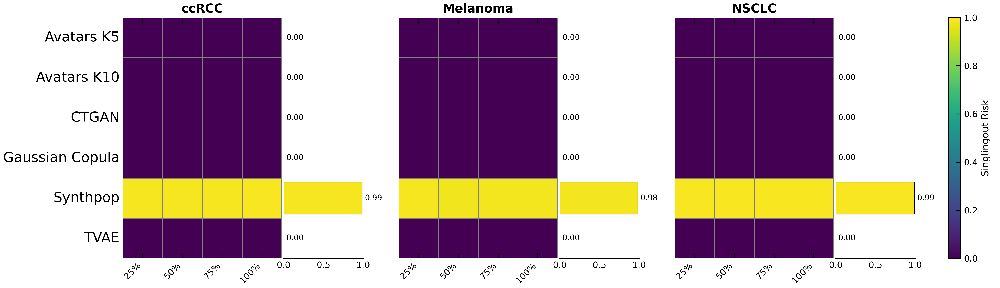
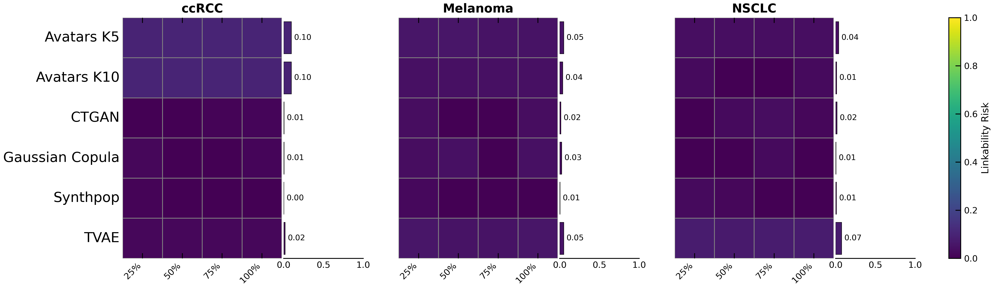
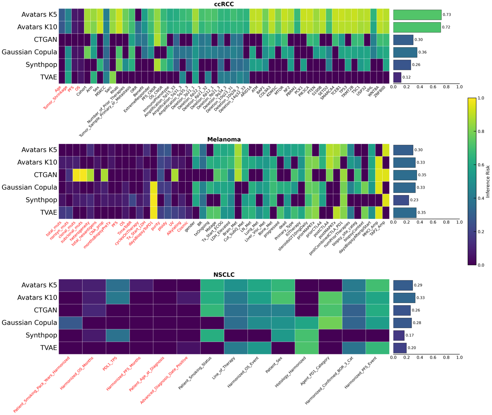
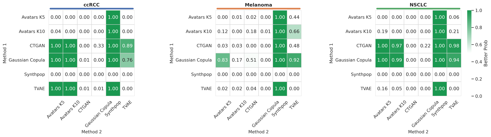

# Privacy Assessment

Privacy preservation is a critical dimension in synthetic data generation for omics and clinical research. While synthetic data aims to enable data sharing and analysis, it must not inadvertently reveal sensitive information about individuals in the original cohort. SynOmicBench evaluates privacy risks using the Anonymeter framework, which quantifies three fundamental dimensions of privacy risk defined by the European Data Protection Board (EDPB): singling-out, linkability, and inference.

Unlike utility metrics that assess how well synthetic data replicates statistical properties or supports downstream tasks, privacy metrics evaluate whether synthetic data can be exploited by adversarial attacks to extract information about real individuals. Effective synthetic data generation must balance utility preservation with robust privacy protection.

## Anonymeter Framework

The Anonymeter library provides a comprehensive privacy evaluation framework based on attack simulations. For each privacy dimension, it constructs realistic attack scenarios and quantifies the risk that an adversary with specific auxiliary knowledge could compromise individual privacy. After simulating multiple attack scenarios, Anonymeter transforms the resulting risks into an overall privacy score, where higher values indicate lower privacy risk and thus stronger privacy preservation.

The three privacy risk dimensions are:

- **Singling-out risk**: The ability to isolate a record belonging to a specific individual based on a combination of attributes
- **Linkability risk**: The ability to link records across datasets that belong to the same individual
- **Inference risk**: The ability to infer unknown "secret" attributes from auxiliary information

## Singling-Out Risk

Singling-out occurs when an attacker can identify a single individual in the dataset based on unique combinations of attributes. Even if direct identifiers (names, medical record numbers) are removed, unique combinations of clinical and molecular features can isolate an individual record. For example, a specific rare mutation combined with an exact age and diagnosis date might uniquely identify a patient.

Anonymeter evaluates singling-out risk by constructing predicates from synthetic data and testing whether these predicates can uniquely identify records in the original dataset. For univariate singling-out, predicates are constructed iteratively using random subsets of features containing 25%, 50%, 75%, and 100% of all features. For multivariate singling-out, the number of attributes included in predicates is progressively increased to assess how predicate dimensionality affects attack effectiveness.

### Code Example

```python
import pandas as pd
from anonymeter.evaluators import SinglingOutEvaluator

# Load original and synthetic data
ori_df = pd.read_csv("original_data.csv")
syn_df = pd.read_csv("synthetic_data.csv")

# Univariate singling-out: test with different feature proportions
cols = ori_df.columns.tolist()
proportions = [0.25, 0.50, 0.75, 1.0]

for p in proportions:
    n = int(len(cols) * p)
    sampled_cols = random.sample(cols, n)
    sampled_ori = ori_df[sampled_cols]
    sampled_syn = syn_df[sampled_cols]
    
    evaluator = SinglingOutEvaluator(
        ori=sampled_ori, 
        syn=sampled_syn, 
        n_attacks=10000,
        max_attempts=1000000,
        seed=42
    )
    evaluator.evaluate(mode='univariate')
    risk = evaluator.risk()
    
    print(f"Features {p*100}%: risk {risk.value:.4f}")

# Multivariate singling-out: test with specific numbers of columns
n_cols = [2, 3, 5, 7, 10, 20, 50, 100]

for n_col in n_cols:
    evaluator = SinglingOutEvaluator(
        ori=ori_df,
        syn=syn_df,
        n_cols=n_col,
        n_attacks=10000,
        max_attempts=1000000,
        seed=42
    )
    evaluator.evaluate(mode='multivariate')
    risk = evaluator.risk()
    
    print(f"Columns {n_col}: risk {risk.value:.4f}")
```



Univariate singling-out risk heatmaps across ccRCC, Melanoma, and NSCLC cohorts. Each cell represents the mean risk across five replicates for a given attack scenario using random feature subsets (25-100%). Boxplots adjacent to each heatmap summarize the average risk per method. Most methods show negligible risk (<0.001), whereas Synthpop exhibits extremely high singling-out risk close to 1.0 across all cohorts, consistent with its high Kolmogorov-Smirnov complement scores indicating near-identical marginal distributions between synthetic and original data.

For univariate singling-out attacks, the majority of synthetic data generation techniques led to attacks either failing or being of negligible risk (<0.001). The notable exception is Synthpop, which exhibited extremely high univariate singling-out risk close to 1.0 for all three datasets. Within the Anonymeter framework, an attack is considered failed when its success rate does not exceed the naive random baseline. For multivariate singling-out, as expected, the effectiveness of singling-out generally decreased with higher-dimensional predicates, reflecting the simultaneous increase in baseline chance success and reduced specificity of targeted attacks. Nevertheless, Synthpop retained the highest multivariate singling-out risk across all cohorts.

## Linkability Risk

Linkability is the ability to connect two or more records relating to the same individual, either within the same dataset or across different datasets. In the context of multi-omics, linkability risk assessment evaluates whether an attacker can reconnect split datasets (e.g., connecting a clinical record to its corresponding transcriptomic profile) using the synthetic data as a bridge.

Anonymeter models linkability attacks by vertically splitting the original dataset into two parts with different auxiliary columns. The evaluator then attempts to reconnect these parts using the synthetic data by looking for the closest neighbors of the split original records. If both splits of an original record have the same (or overlapping) closest synthetic neighbors, they are considered successfully linked.

### Code Example

```python
import pandas as pd
from anonymeter.evaluators import LinkabilityEvaluator

# Load original and synthetic data
ori_df = pd.read_csv("original_data.csv")
syn_df = pd.read_csv("synthetic_data.csv")

# Define two sets of auxiliary columns the attacker might possess
# For example, clinical features in one dataset and molecular features in another
aux_cols = (
    ['Age', 'Gender', 'Tumor_Stage'],  # First dataset
    ['TP53_mutation', 'EGFR_expression', 'KRAS_mutation']  # Second dataset
)

# Evaluate linkability risk
evaluator = LinkabilityEvaluator(
    ori=ori_df,
    syn=syn_df,
    aux_cols=aux_cols,
    n_attacks=500,
    n_neighbors=1
)

evaluator.evaluate(n_jobs=-2)
risk = evaluator.risk()

print(f"Linkability risk: {risk.value:.4f} (CI: {risk.low:.4f} - {risk.high:.4f})")
```



Linkability risk heatmaps represent the risk that synthetic records enable re-linking of disjoint attribute groups (clinical and molecular subsets) belonging to the same original individual. Risks remain consistently low across all synthetic data generation methods and cancer types, indicating that synthetic datasets largely prevent record-level re-identification through attribute bridging, even when progressively larger transcriptomic feature subsets were used for linkage.

Linkability risk remained consistently low across all synthetic data generation methods and cancer types. This indicates that synthetic datasets largely prevent record-level re-identification through attribute bridging, even when progressively larger transcriptomic feature subsets were used for linkage attempts.

## Inference Risk

Inference risk refers to the possibility of deducing the value of a sensitive attribute with high probability by observing other attributes in the dataset. For example, if a synthetic model learns a strong correlation between certain gene expression levels and a specific clinical outcome, an attacker might infer a patient's sensitive health status by observing their gene expression profile.

Anonymeter evaluates inference risk by treating some attributes as "secrets" that the attacker aims to infer, and other attributes as "auxiliary information" available to the attacker. The evaluator trains predictive models on the synthetic data to infer secret attributes from auxiliary features, then tests how accurately these models can predict secrets in the original data. For categorical secrets, inference is assessed via exact-match classification; for numerical secrets, it uses regression-based evaluation with relative error thresholds.

### Code Example

```python
import pandas as pd
from anonymeter.evaluators import InferenceEvaluator

# Load original and synthetic data
ori_df = pd.read_csv("original_data.csv")
syn_df = pd.read_csv("synthetic_data.csv")

# Define auxiliary columns (features the attacker has access to)
# and secret columns (sensitive attributes to be inferred)
genes_cols = ori_df.columns.tolist()[10:]  # Transcriptomic features
clinical_cols = ori_df.columns.tolist()[:10]  # Clinical features as secrets

# Evaluate inference risk for each clinical secret
results = []
for secret in clinical_cols:
    evaluator = InferenceEvaluator(
        ori=ori_df,
        syn=syn_df,
        aux_cols=genes_cols,
        secret=secret,
        n_attacks=ori_df.shape[0]
    )
    
    evaluator.evaluate(n_jobs=-2)
    risk = evaluator.results().risk()
    
    results.append({
        'secret': secret,
        'risk': risk.value,
        'ci_low': risk.low,
        'ci_high': risk.high
    })
    
    print(f"Secret {secret}: Privacy Risk {risk.value:.4f}")

results_df = pd.DataFrame(results)
```



Attribute inference risk heatmaps illustrate the risk of inferring hidden "secret" attributes (clinical outcomes and genomic features) from auxiliary transcriptomic information. Numerical attributes generally show lower risk than categorical attributes due to regression-based evaluation, whereas categorical secrets are assessed via exact-match classification. Boxplots summarize mean inference risk per method. Color intensity indicates risk magnitude, with warmer colors denoting higher risk.

Attribute inference represented the most substantial residual privacy risk across methods. Using transcriptomic features to infer clinical or genomic attributes, inference risks ranged approximately from 0.4 to 0.75 across datasets. In ccRCC, Avatars K5 and K10 exhibited higher average inference risks (0.74) compared with other approaches (0.4-0.5), while CTGAN showed the highest inference risk in the Melanoma cohort (0.66). In NSCLC, all methods demonstrated comparable inference risks (0.4-0.5). Notably, numerical clinical attributes consistently displayed lower inference risk than categorical attributes, reflecting Anonymeter's evaluation design in which categorical secrets are assessed via exact-match classification, whereas numerical attributes are inferred through regression based on relative error thresholds.

## Overall Privacy Assessment

After simulating multiple attack scenarios across the three privacy dimensions, Anonymeter transforms the resulting risks into an overall privacy score, where higher values indicate lower privacy risk and thus stronger privacy preservation. Table 4 reports the overall privacy scores for each synthetic dataset across the three cancer types.

| Synthetic Data    | ccRCC           | Melanoma        | NSCLC           |
| :---------------- | :-------------- | :-------------- | :-------------- |
| Avatars K5        | 0.771 ± 0.003   | 0.848 ± 0.002   | 0.861 ± 0.004   |
| Avatars K10       | 0.775 ± 0.005   | 0.853 ± 0.005   | 0.867 ± 0.004   |
| CTGAN             | **0.859 ± 0.005** | 0.848 ± 0.006   | **0.892 ± 0.006** |
| Gaussian Copula   | 0.852 ± 0.005   | **0.858 ± 0.002** | 0.885 ± 0.002   |
| Synthpop          | 0.597 ± 0.004   | 0.611 ± 0.002   | 0.630 ± 0.003   |
| TVAE              | 0.836 ± 0.009   | 0.839 ± 0.009   | 0.863 ± 0.007   |



Bayesian comparison of overall privacy scores. Pairwise probability heatmaps show the posterior probability P(row > column) that the synthetic data generation method in a given row achieves a higher aggregated privacy score than the method in the corresponding column. CTGAN and Gaussian Copula consistently achieve the highest overall privacy scores across cohorts.

Overall, aggregated privacy scores and Bayesian comparative analysis suggest that CTGAN and Gaussian Copula offer the best privacy preservation among tested synthetic data generation models on oncology datasets. In contrast, Synthpop is the least privacy-preserving method, largely affected by the extremely high singling-out risk.

## Observations

- Synthpop exhibits extremely high univariate singling-out risk close to 1.0 across all three cancer cohorts, consistent with its near-identical marginal distributions between synthetic and original data
- Most synthetic data generation methods (CTGAN, TVAE, Gaussian Copula, Avatars K5/K10) achieve negligible singling-out risk (<0.001) for univariate and multivariate attacks
- Linkability risk remains consistently low across all methods and cancer types, indicating robust protection against record-level re-identification through attribute bridging
- Attribute inference represents the most substantial residual privacy risk (0.4-0.75), with Avatars K5/K10 showing highest risk in ccRCC (0.74) and CTGAN highest in Melanoma (0.66)
- Numerical clinical attributes consistently display lower inference risk than categorical attributes, reflecting differences in evaluation methodology (regression vs exact-match classification)
- Overall privacy scores indicate that CTGAN and Gaussian Copula provide the strongest privacy preservation across oncology datasets, while Synthpop shows the weakest protection due to extreme singling-out risk
