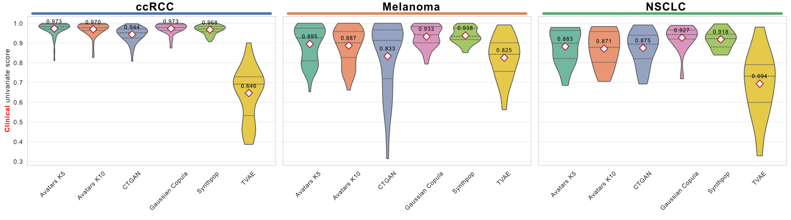

# Statistical Fidelity

Statistical fidelity evaluates how faithfully synthetic data reproduces the **statistical properties** of the original dataset at two levels: marginal distributions of individual features (univariate similarity) and pairwise relationships between features (bivariate similarity).

## Univariate Similarity

Univariate similarity measures how well the distribution of each individual feature is preserved.

### Metrics

- **Numerical features** — the [Kolmogorov–Smirnov (KS)](https://docs.sdv.dev/sdmetrics/data-metrics/quality/kscomplement) statistic measures the maximum distance between the cumulative distributions:

$$s_k = 1 - \text{KS}\!\bigl(\text{CDF}(F_k^{\text{original}}),\; \text{CDF}(F_k^{\text{synthetic}})\bigr)$$

- **Categorical features** — the [Total Variation Distance (TVD)](https://docs.sdv.dev/sdmetrics/data-metrics/quality/tvcomplement) quantifies the discrepancy between frequency distributions:

$$s_k = 1 - \text{TVD}(F_{k,\text{original}},\; F_{k,\text{synthetic}})$$

To ensure balanced evaluation across modalities, the final univariate score averages the mean scores of clinical and transcriptomic features separately:

$$\text{UnivariateScore}_A = \frac{1}{2}\left(\frac{1}{N}\sum_{i \in \text{Clinical}}^{N} s_i + \frac{1}{M}\sum_{j \in \text{Transcriptomic}}^{M} s_j\right)$$

where $N$ and $M$ denote the total number of clinical features and genes, respectively.

---

### Code Example

```python
from SynOmics.metrics.fidelity.UnivariateSimilarity import UnivariateSimilarity
from SynOmics.processing.metadata import MetaData

# Compute metadata (auto-detect feature types)
metadata = MetaData.get_metadata(
    data=original_data,
    threshold_unique_values=10,
    ordinal_features=None
)

# Compute univariate similarity scores
uni = UnivariateSimilarity(output_dir="results/broad_utility")
scores = uni.get_univariate_score(
    original_data=original_data,
    synthetic_data=synthetic_data,
    metadata=metadata
)
detail_df = uni.get_detail_df()

print(f"Univariate Score: {scores:.4f}")
print(detail_df.head())
```

---

## Bivariate Similarity

Bivariate similarity evaluates how well pairwise relationships between features are preserved.

### Metrics

- **Numerical–numerical pairs** — Spearman's rank correlation ($\rho$):

$$s_{i,j} = 1 - \frac{1}{2}\left|\rho_{i,j}^{\text{original}} - \rho_{i,j}^{\text{synthetic}}\right|$$

- **Categorical–categorical and mixed pairs** — Cramér's V. For mixed pairs, numerical features are discretized into 10 bins:

$$s_{i,j} = 1 - \left|V_{i,j}^{\text{original}} - V_{i,j}^{\text{synthetic}}\right|$$

The overall bivariate score equally weights three functional modalities:

$$\text{BivariateScore}_A = \frac{1}{3}\left(\bar{S}_{\text{transcriptomic–transcriptomic}} + \bar{S}_{\text{clinical–transcriptomic}} + \bar{S}_{\text{clinical–clinical}}\right)$$

where each $\bar{S}_{\text{modality}}$ is the mean similarity score over all feature pairs within that category.

---

### Code Example


```python
from SynOmics.metrics.fidelity.PairwiseSimilarity import PairwiseSimilarity
from SynOmics.processing.metadata import MetaData

metadata = MetaData.get_metadata(
    data=original_data,
    threshold_unique_values=10,
    ordinal_features=None
)

pairwise = PairwiseSimilarity(output_dir="results/broad_utility")
scores = pairwise.get_pairwise_score(
    original_data=original_data,
    synthetic_data=synthetic_data,
    metadata=metadata
)

print(f"Bivariate Score: {scores:.4f}")
```

---

### Visualization

The violin plot below shows the distribution of per-feature bivariate similarity scores across SDG methods. The `plot_violin` function from the broad utility analysis module produces manuscript-quality figures:

```python
from SynOmics.metrics.fidelity.visualization import plot_violin_grid_by_cancer

# scores_dict: mapping from method name to list ofs scores   
# Univariate similarity scores: the list of per-feature scores
# Bivariate similarity scores: the list of per-pair scores
Score_Dict = {
    "Avatars K5": avatars_k5_scores, 
    "Avatars K10": avatars_k10_scores,
    "CTGAN": ctgan_scores,
    "Gaussian Copula": gc_scores,
    "Synthpop": synthpop_scores,
    "TVAE": tvae_scores,
}

fig, axes, mean_by_cancer = plot_violin_grid_by_cancer(
    cancer_to_method_scores=Score_Dict,
    value_name="Univariate Score", 
    figsize=(18, 5)
)
```
