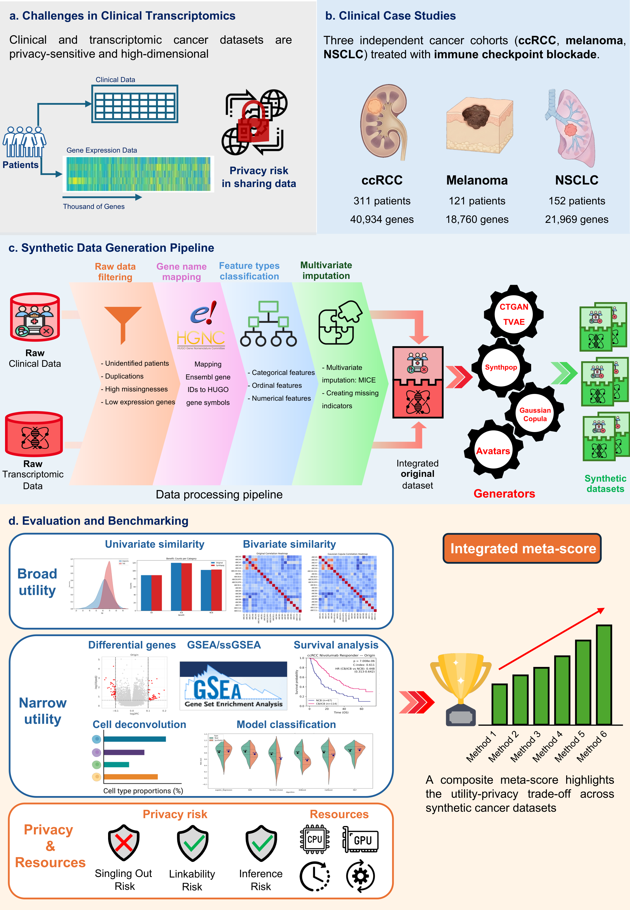

# **SynOmicBench**: A unified benchmark of synthetic data generation for clinical and transcriptomic cancer data

Welcome to the **SynOmicBench** documentation. This project provides a comprehensive framework for the generation, evaluation, and benchmarking of synthetic clinical and transcriptomic data in the context of precision oncology.

## Abstract

Achieving a trade-off between biological utility and patient privacy remains a key challenge for secure data sharing when applying transcriptomic clinical datasets to artificial intelligence in precision oncology. Here, we introduce the first benchmarking study tailored to high-dimensional clinical transcriptomic cancer data, comparing synthetic data generation methods across three clinical cancer trials. Our framework, SynOmicBench, combines standardized preprocessing with multidimensional evaluation, prioritizing downstream biological validation alongside statistical fidelity and attack-based privacy assessment. Results indicate that no single method dominated all dimensions, with Gaussian Copula achieving the most balanced performance, followed by Avatar, demonstrating that metric-based similarity alone is insufficient to ensure preservation of higher-order molecular dependencies. Synthetic data consistently reproduced biomedical signal directionality but with attenuated effect sizes and inter-replicate variability, supporting hypothesis generation when multi-seed synthesis is adopted. Collectively, this framework provides a reproducible decision-support tool for method selection and promotes biologically informed, privacy-aware adoption of synthetic data in precision oncology.
--- 
## Framework Overview

***Figure 1**: Overview of the SynOmicBench benchmarking protocol. (a) Data sensitivity and high-dimensionality of clinical-transcriptomic profiles. (b) Case studies across three cancer types (ccRCC, Melanoma, NSCLC). (c) Standardized generation pipeline. (d) Multidimensional evaluation framework covering Statistical Fidelity, Biological Utility, and Privacy Risk.*

The SynOmicBench pipeline combines standardized preprocessing with a multidimensional evaluation suite, prioritizing downstream biological validation alongside statistical fidelity and attack-based privacy assessment.

---

## Benchmarked Datasets

SynOmicBench utilizes three diverse cancer cohorts treated with immune checkpoint blockade (ICB), reflecting realistic heterogeneity in sample size and transcriptomic dimensionality (Figure 1b). 

***Table 1**: Overview of benchmarked cancer datasets.*

| Dataset characteristic | Sub-category | ccRCC | Melanoma | NSCLC |
| --- | --- | --- | --- | --- |
| **Number of patients** |  | 311 | 121 | 152 |
| **Number of clinical features** |  | 52 | 47 | 14 |
| **Number of transcriptomics features** |  | 40,934 | 18,760 | 21,969 |
| **Gene expression level** |  | Transcripts Per Kilobase Million (TPM) | TPM | TPM |
| **Age (year), median (range)** |  | 63 (30-88) | — | 64 (40-89) |
| **Sex** | Male | 229 | 71 | 87 |
|  | Female | 82 | 50 | 65 |
| **Clinical outcomes** | Partial Response/Complete Response (PR/CR) | 44 | 47 | 60 |
|  | Progressive Disease (PD) | 106 | 56 | 50 |
|  | Stable Disease (SD) | 131 | 16 | 42 |
|  | Others | 30 | 2 | 0 |
| **Study source** |  | [Braun et al. (2020)](https://www.nature.com/articles/s41591-020-0839-y) | [Liu et al. (2019)](https://www.nature.com/articles/s41591-019-0654-5) | [Ravi et al. (2023)](https://www.nature.com/articles/s41591-020-0839-y) |

---

## Synthetic Data Generation (SDG) Pipeline

As illustrated in Figure 1c, clinical and transcriptomic data were harmonized and integrated through a standardized data processing pipeline. This process ensured consistency and compatibility across SDG methods. The processed dataset was subsequently used to train SDG models (Gaussian Copula, CTGAN, TVAE, Synthpop and Avatars (K5/K10)), which generated patient-level synthetic multimodal datasets. 

## Evaluation Pillars

SynOmicBench evaluates synthetic data through three primary lenses (Figure 1d):

### 1.Statistical Fidelity

Validates the preservation of global statistical properties by comparing:

*   **Univariate Similarity**: Marginal distributions of individual attributes.
*   **Bivariate Similarity**: Inter-variable relationships and correlation structures.

### 2. Biological Utility (Biological Signal)

Evaluates task-specific performance in clinically relevant downstream analyses:

*   **Differential Gene Expression (DGE)**: Preservation of fold-changes and p-values of gene expression.
*   **Gene Set Enrichment (GSEA/ssGSEA)**: Recovery of biological pathway activities.
*   **Cell Type Deconvolution**: Consistency in estimated cell fractions.
*   **Survival Analysis**: Preservation of Kaplan-Meier curves and C-index.
*   **Predictive Modeling**: Transferability of classification models.

### 3. Privacy Risk

Quantifies disclosure vulnerability aligned with the European Data Protection Board (EDPB) regulatory principles:

*   **Singling-Out**: Risk of isolating a unique individual.
*   **Linkability**: Risk of connecting records from multiple datasets.
*   **Inference**: Risk of deducing sensitive attribute values.

---

## 🚀 Explore the Documentation

-   **[Getting Started](getting-started/index.md)**

    Learn how to install and run your first benchmark.

- **[Preprocessing Data](preprocessing/index.md)**

    Data integration and cleaning pipeline.

-  **[Generate Synthetic Data](synthetic-data/index.md)**

    SDG methods and adaptations.

- **[Evaluation Results](evaluation/index.md)**

    Benchmarking results across all metrics.

- **[API Reference](api/index.md)**

    Auto-generated API documentation.

---

## Citation

If you use SynOmicBench in your research, please cite our manuscript:

> Trinh, T. C., Woillard, J. B., Uguzzoni, G., & Battail, C. (2024). **A unified benchmark of synthetic data generation for clinical and transcriptomic cancer data.**

This framework is currently described in a manuscript under preparation/submission. Check back for updated citation details.

---
