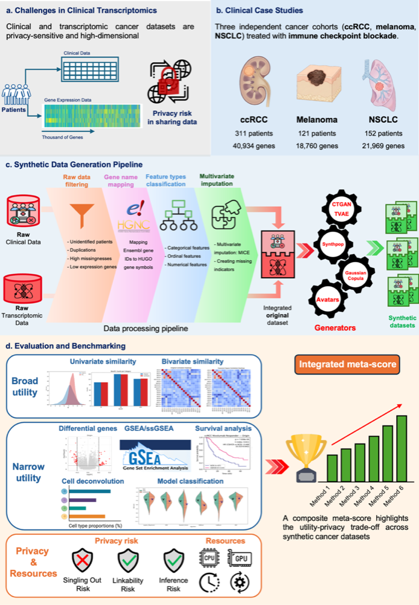

# SynOmicBench: A Unified Benchmark for Synthetic Cancer Omics

Welcome to the **SynOmicBench** documentation. This platform provides a comprehensive framework for the generation, evaluation, and benchmarking of synthetic clinical and transcriptomic data in the context of precision oncology.

Achieving an appropriate trade-off between **biological utility** and **patient privacy** remains a critical challenge for secure data sharing when applying high-dimensional omics datasets to artificial intelligence. SynOmicBench introduces the first disease-agnostic benchmarking study tailored to this domain, comparing state-of-the-art synthetic data generation (SDG) methods across multiple cancer types.

---

## 🔬 Framework Overview

*Figure 1: Overview of the SynOmicBench benchmarking protocol. (a) Data sensitivity and high-dimensionality of clinical-transcriptomic profiles. (b) Case studies across three cancer types (ccRCC, Melanoma, NSCLC). (c) Standardized generation pipeline. (d) Multidimensional evaluation framework covering Broad Utility, Narrow Utility, and Privacy Risk.*

The SynOmicBench pipeline combines standardized preprocessing with a multidimensional evaluation suite, prioritizing downstream biological validation alongside statistical fidelity and attack-based privacy assessment.

!!! abstract "Key Findings"
    Our results indicate that **no single method dominated all dimensions**. However, **Gaussian Copula** achieved the most balanced performance across fidelity, utility, and privacy metrics. While synthetic data consistently reproduced signal directionality, it often exhibited attenuated effect sizes, supporting its primary use for hypothesis generation and model pre-training.

---

## 📊 Benchmarked Datasets

SynOmicBench utilizes three diverse cancer cohorts treated with immune checkpoint blockade (ICB), reflecting realistic heterogeneity in sample size and transcriptomic dimensionality.

| Dataset | Patients | Clinical Features | Omics Features | Expression Level | Study Source |
| :--- | :---: | :---: | :---: | :---: | :--- |
| **ccRCC** | 311 | 52 | 40,934 | TPM | Braun et al. (2020) |
| **Melanoma** | 121 | 47 | 18,760 | TPM | Liu et al. (2019) |
| **NSCLC** | 152 | 14 | 21,969 | TPM | Ravi et al. (2023) |

---

## 🤖 SDG Methods Evaluated

We benchmarked six configurations representing three major categories of synthetic data generation:

1.  **Gaussian Copula**: A statistical approach that models multivariate dependencies using copula functions.
2.  **CTGAN**: Conditional Tabular Generative Adversarial Networks, designed specifically for tabular data.
3.  **TVAE**: Tabular Variational Autoencoders, an adaptation of VAEs for mixed-type tabular datasets.
4.  **Synthpop**: A regression-based synthesis tool using sequential conditional distributions.
5.  **Avatars (K5 & K10)**: A k-anonymity based approach that generates synthetic "avatars" from local patient neighborhoods.

---

## 📐 Evaluation Pillars

SynOmicBench evaluates synthetic data through three primary lenses to ensure a comprehensive understanding of the utility-privacy trade-off:

### 1. Broad Utility (Statistical Fidelity)
Validates the preservation of global statistical properties by comparing:
*   **Univariate Similarity**: Marginal distributions of individual attributes.
*   **Bivariate Similarity**: Inter-variable relationships and correlation structures.

### 2. Narrow Utility (Biological Signal)
Evaluates task-specific performance in clinically relevant downstream analyses:
*   **Differential Gene Expression (DGE)**: Preservation of fold-changes and p-values.
*   **Gene Set Enrichment (GSEA/ssGSEA)**: Recovery of biological pathway activities.
*   **Cell Deconvolution**: Consistency in estimated immune cell fractions.
*   **Survival Analysis**: Preservation of Kaplan-Meier curves and Hazard Ratios.
*   **Predictive Modeling**: Transferability of classification models.

### 3. Privacy Risk
Quantifies disclosure vulnerability aligned with EDPB regulatory principles:
*   **Singling-Out**: Risk of isolating a unique individual.
*   **Linkability**: Risk of connecting records from multiple datasets.
*   **Inference**: Risk of deducing sensitive attribute values.

---

## 🚀 Explore the Documentation

-   :material-rocket-launch:{ .lg .middle } **[Getting Started](getting-started/index.md)**

    Learn how to install the framework and run your first benchmark.

-   :material-layers-outline:{ .lg .middle } **[Framework Documentation](framework/index.md)**

    Detailed explanation of the preprocessing and SDG algorithms.

-   :material-chart-bar:{ .lg .middle } **[Evaluation Results](evaluation/index.md)**

    In-depth analysis of the benchmarking results across all metrics.

---

## 📝 Citation

If you use SynOmicBench in your research, please cite our manuscript:

> Trinh, T. C., Woillard, J. B., Uguzzoni, G., & Battail, C. (2024). **A unified benchmark of synthetic data generation for clinical and transcriptomic cancer data.**

!!! info "Manuscript Status"
    This framework is currently described in a manuscript under preparation/submission. Check back for updated citation details.

---
