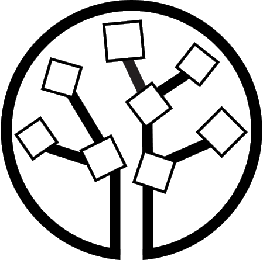

# Generate Synthetic Data

## Synthetic Data Generation (SDG) Methods

Our study leverages five synthetic data generation (SDG) methods through their official libraries.

<div class="sdg-cards-grid">
  <!-- Avatars -->
  <a href="https://www.nature.com/articles/s41746-023-00771-5" target="_blank" class="sdg-card">
    <div class="sdg-card-front">
      
      <h3>Avatars</h3>
    </div>
  </a>

  <!-- CTGAN -->
  <a href="https://papers.nips.cc/paper_files/paper/2019/hash/254ed7d2de3b23ab10936522dd547b78-Abstract.html" target="_blank" class="sdg-card">
    <div class="sdg-card-front">
      
      <h3>CTGAN</h3>
    </div>
  </a>

  <!-- Gaussian Copula -->
  <a href="https://github.com/sdv-dev/Copulas" target="_blank" class="sdg-card">
    <div class="sdg-card-front">
      
      <h3>Gaussian Copula</h3>
    </div>
  </a>

  <!-- Synthpop -->
  <a href="https://www.jstatsoft.org/article/view/v074i11" target="_blank" class="sdg-card">
    <div class="sdg-card-front">
      
      <h3>Synthpop</h3>
    </div>
  </a>


  <!-- TVAE -->
  <a href="https://papers.nips.cc/paper_files/paper/2019/hash/254ed7d2de3b23ab10936522dd547b78-Abstract.html" target="_blank" class="sdg-card">
    <div class="sdg-card-front">
      
      <h3>TVAE</h3>
    </div>
  </a>
</div>

Five SDG methods were benchmarked across three cancer types (NSCLC, melanoma, ccRCC), each repeated 5 times with different random seeds to assess the robustness of each method.

Naive fitting of synthetic data generation methods often fails on high-dimensional and heterogeneous multi-omic datasets. Therefore, we designed adaptations for each method to handle these challenges. 

- CTGAN and TVAE requires GPU for training on high-dimensional data.
- Gaussian Copula requires a suitable encoding for categorical variables.
- Synthpop requires a custom predictor matrix optimization to handle high-dimensional data.
- Avatars requires a feature clustering to partition the features into batch before submitting to the API.

Detail description of each adaptation is provided in the manuscript of this work and [GitHub repository](https://github.com/thechuongtrinh/SynOmicBench).

---

## Usage Example

### 1. Gaussian Copula

```python
from SynOmics.synthesizer.GaussianCopulasynthesizer import GaussianCopulasynthesizer
from SynOmics.processing.metadata import MetaData

original_data = pd.read_csv("original_data.csv")
metadata = MetaData.getmeta(metadata_path)

seed = 42 

output_path = "gaussiancopula_result"
synth = GaussianCopulasynthesizer(output_path=output_path, metadata=metadata)

synthetic_data = synth.generate(
data=original_data,
n_samples=original_data.shape[0],
seed=seed,
fit_params={"n_jobs": -1, "chunk_size": 1000},
output_filename="gaussiancopula_synthetic_data.csv",
)
```

### 2. CTGAN

```python
import pandas as pd
from SynOmics.synthesizer.CTGANsynthesizer import CTGANsynthesizer

synthesizer = CTGANsynthesizer(output_path=f"ctgan_result", metadata=metadata)
synthetic_data = synthesizer.generate(
    data=original_data,
    n_samples=original_data.shape[0],
    seed=4,
    fit_params={"epochs": 200, "verbose": False, "cuda": True},
    output_filename="synthetic_data_ctgan.csv"
)
```

### 3. TVAE

```python
import pandas as pd
from SynOmics.synthesizer.TVAEsynthesizer import TVAEsynthesizer

synthesizer = TVAEsynthesizer(output_path=f"tvae_result", metadata=metadata)

synthetic_data = synthesizer.generate(
    data=original_data,
    n_samples=original_data.shape[0],
    seed=42,
    fit_params={"epochs": 500, "verbose": False, "cuda": True},
    output_filename="synthetic_data_tvae.csv"
)
```

### 4. Synthpop

```python
import pandas as pd
import numpy as np
from SynOmics.synthesizer.Synthpopsynthesizer import SynthpopSynthesizer

# Prepare categorical features
grouped_metadata = MetaData.grouping_features_astype(original_data, metadata)
categorical_features = grouped_metadata.get("ordinal_categorical") + \
                       grouped_metadata.get("dummy_categorical") + \
  

# Load and configure predictor matrix for high-dimensional data
predictor_matrix = np.load("synthpop/predictor_matrix.npy")
predictor_df = pd.DataFrame(predictor_matrix, index=original_data.columns, columns=original_data.columns)

r_home = "/opt/R/4.4.1/lib/R" # Path to R installation
r_terminal = "R441" # Name of the R terminal

synth = SynthpopSynthesizer(output_path=f"synthpop_result", metadata=metadata, r_home=r_home, r_terminal=r_terminal)
synthetic_data = synth.generate(
    data=original_data, 
    seed=42, 
    n_samples=original_data.shape[0], 
    sample_params={
        "discrete_columns": categorical_features,
        "method": "cart",
        "predictor_matrix": predictor_df
    }, 
    output_filename="synthpop_synthetic_data.csv"
)
```

### 5. Avatars

> [!NOTE] 
> Avatars requires a proprietary Octopize license. The example below highlights the specialized adaptations (data block chunking and feature clustering) used in SynOmicBench to handle high-dimensional omic data over the API.

```python
import pandas as pd
import json
from avatars.manager import Manager
from avatars.models import JobKind

# Authenticate with the Avatars API
manager = Manager(base_url="https://www.octopize.app/api")
manager.authenticate("user@company.com", "password", should_verify_compatibility=False)

# Load clustered features optimized for high-dimensional data
with open("avatars/cluster_final.json", "r") as f:
    cluster_features = json.load(f)

k = 10
seed = 42

# Process data iteratively in partitioned blocks
for i in range(len(cluster_features)):
    data_clean = pd.read_csv(f"avatars/original_blocks/original_block_{i}.csv").drop(columns=["Patient_ID"])
    
    table_name = f"block_{i}"
    runner = manager.create_runner(f"Job_Block_{i}", seed=seed)
    runner.add_table(table_name, data_clean)
    runner.set_parameters(table_name, k=k)
    
    # Run the synthesis job
    runner.run(jobs_to_run=[JobKind.standard])
    
    # Retrieve and save the synthetic data block
    synthetic_df = runner.sensitive_unshuffled(table_name)
    synthetic_df.to_csv(f"synthetic_block_{i}.csv", index=False)

#Once all blocks are generated, concatenate them to form the final synthetic dataset
concat_syns = []

for i in range(0, len(cluster_features)):
    block = pd.read_csv(f"synthetic_block_{i}.csv", index_col =False)
    concat_syns.append(block)

synthetic_data = pd.concat(concat_syns, axis = 1)
```